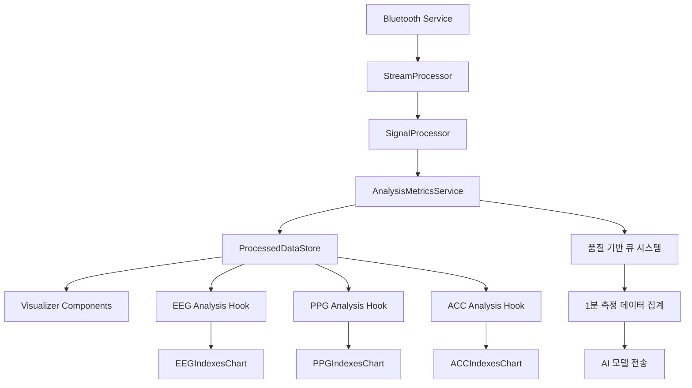

# AI Health Report 생성 기능 완전 구현 기획서

## 📋 프로젝트 개요

### 목표
사용자가 LINK BAND 디바이스를 통해 1분간 측정한 EEG, PPG, ACC 데이터를 기반으로 AI가 생성하는 개인 맞춤형 건강 리포트 제공

### 전체 UX 흐름
```
사용자 정보 입력 → 디바이스 연결 → 착용 및 데이터 품질 확인 → 1분 측정 → 분석 대기 → 리포트 시각화
```

## 🔍 1. 현재 데이터 흐름 완전 분석

### 1.1 전체 데이터 아키텍처


### 1.2 ProcessedDataStore 중심의 데이터 관리
```typescript
// 핵심 데이터 소스: ProcessedDataStore
interface ProcessedDataStore {
  // 실시간 그래프 데이터
  eegGraphData: { fp1: GraphDataPoint[]; fp2: GraphDataPoint[]; };
  ppgGraphData: { red: GraphDataPoint[]; ir: GraphDataPoint[]; };
  accGraphData: { x: GraphDataPoint[]; y: GraphDataPoint[]; z: GraphDataPoint[]; };
  
  // 분석 결과
  eegAnalysis: EEGAnalysisResult;     // 뇌파 분석 지표
  ppgAnalysis: PPGAnalysisResult;     // 심박변이도 분석 지표
  accAnalysis: ACCAnalysisResult;     // 활동량 분석 지표
  
  // 신호 품질 지수
  sqiData: SQIData;                   // EEG, PPG SQI 데이터
  
  // 이동평균 데이터 (안정화된 값)
  movingAverageData: MovingAverageData;
}
```

### 1.3 Visualizer 데이터 연결 복잡성 해결
**현재 Visualizer가 사용하는 주요 Hook들:**
```typescript
// EEG 데이터
const eegAnalysis = useEEGAnalysis();           // EEG 분석 지표
const eegSQIData = useEEGSQIData();            // EEG 신호 품질
const eegMovingAverage = useEEGMovingAverage(); // EEG 이동평균
const eegGraphData = useEEGGraphData();        // EEG 원시 그래프

// PPG 데이터  
const ppgAnalysis = usePPGAnalysis();           // PPG 분석 지표
const ppgSQIData = usePPGSQIData();            // PPG 신호 품질
const ppgMovingAverage = usePPGMovingAverage(); // PPG 이동평균
const ppgGraphData = usePPGGraphData();        // PPG 원시 그래프

// ACC 데이터
const accAnalysis = useACCAnalysis();           // ACC 분석 지표
const accBufferData = useACCBufferData();      // ACC 버퍼 데이터

// 연결 상태
const isConnected = useConnectionState();       // 디바이스 연결 상태
const { isSensorContacted } = useSensorContactStatus(); // 센서 접촉 상태
```

## 🏗️ 2. 아키텍처 설계

### 2.1 프로젝트 구조 배치
```
src/
├── domains/
│   └── ai-report/
│       ├── components/
│       │   ├── AIHealthReportApp.tsx          # 메인 앱 컴포넌트
│       │   ├── PersonalInfoScreen.tsx         # 사용자 정보 입력
│       │   ├── DeviceConnectionScreen.tsx     # 디바이스 연결 (기존 DeviceManager 활용)
│       │   ├── DataQualityScreen.tsx          # 착용 및 데이터 품질 확인 (기존 Visualizer 활용)
│       │   ├── MeasurementScreen.tsx          # 1분 측정 화면
│       │   ├── AnalysisScreen.tsx             # 분석 대기 화면
│       │   └── ReportScreen.tsx               # 리포트 시각화
│       ├── hooks/
│       │   ├── usePersonalInfo.ts             # 사용자 정보 관리
│       │   ├── useDeviceConnection.ts         # 디바이스 연결 상태 (기존 store 활용)
│       │   ├── useMeasurementSession.ts       # 측정 세션 관리 ⭐ 핵심
│       │   ├── useDataQuality.ts              # 데이터 품질 모니터링 (기존 hook 래핑)
│       │   └── useReportGeneration.ts         # 리포트 생성
│       ├── services/
│       │   ├── MeasurementSessionService.ts   # ⭐ 1분 측정 세션 관리
│       │   ├── ReportGenerationService.ts     # AI 리포트 생성
│       │   └── PersonalInfoService.ts         # 사용자 정보 관리
│       ├── types/
│       │   ├── measurement.ts                 # 측정 관련 타입
│       │   ├── report.ts                      # 리포트 관련 타입
│       │   └── index.ts                       # 통합 타입
│       └── utils/
│           ├── MeasurementSession.ts          # ⭐ 측정 세션 클래스
│           ├── dataAggregation.ts             # 데이터 집계 유틸리티
│           └── reportValidation.ts            # 리포트 검증 유틸리티
```

### 2.2 기존 컴포넌트 활용 전략

#### temp_disabled/DeviceManager.tsx → DeviceConnectionScreen
```typescript
// 활용 방법: 디바이스 연결 로직과 UI를 그대로 가져와서 AI Report 플로우에 맞게 수정
// 주요 기능:
// - 디바이스 스캔 및 연결
// - 연결 상태 모니터링  
// - 브라우저 호환성 체크
// - 연결 완료 시 다음 단계로 진행
```

#### temp_disabled/Visualizer → DataQualityScreen
```typescript
// 활용 방법: Visualizer의 실시간 차트들을 활용하여 데이터 품질 확인 화면 구성
// 주요 기능:
// - EEG, PPG, ACC 실시간 시각화 (기존 Visualizer 컴포넌트 재활용)
// - SQI ≥ 80% 품질 기준 모니터링
// - 센서 접촉 상태 확인
// - 안정적인 신호 10초 유지 시 다음 단계 진행
```

## 🎯 3. 1분간 데이터 수집 및 집계 핵심 전략

### 3.1 AnalysisMetricsService 확장 방안
```typescript
// src/domains/ai-report/services/AnalysisMetricsService.ts (기존 확장)

export class AnalysisMetricsService {
  // 기존 품질 큐들 (이미 SQI ≥ 80% 데이터만 저장됨)
  private eegQualityQueue: Array<EEGQualityData> = [];
  private ppgQualityQueue: Array<PPGQualityData> = [];
  private accQualityQueue: Array<ACCQualityData> = [];
  
  // ⭐ 새로 추가: 측정 세션 관리
  private measurementSessions: Map<string, MeasurementSession> = new Map();
  
  /**
   * 1분 측정 세션 시작
   */
  startMeasurementSession(sessionId: string): MeasurementSession {
    const session = new MeasurementSession(sessionId);
    this.measurementSessions.set(sessionId, session);
    
    // 기존 데이터 처리 파이프라인에 세션 리스너 추가
    this.addMeasurementSessionListener(session);
    
    return session;
  }
  
  /**
   * 기존 데이터 처리 파이프라인과 연결
   */
  private addMeasurementSessionListener(session: MeasurementSession): void {
    // processEEGAnalysisMetrics 호출 시 세션에도 데이터 추가
    // processPPGAnalysisMetrics 호출 시 세션에도 데이터 추가  
    // processACCAnalysisMetrics 호출 시 세션에도 데이터 추가
  }
}
```

### 3.2 MeasurementSession 클래스 (핵심)
```typescript
// src/domains/ai-report/utils/MeasurementSession.ts

export class MeasurementSession {
  private sessionId: string;
  private startTime: number;
  private endTime: number | null = null;
  
  // ProcessedDataStore에서 데이터를 가져와서 집계
  private eegDataHistory: EEGQualityData[] = [];
  private ppgDataHistory: PPGQualityData[] = [];
  private accDataHistory: ACCQualityData[] = [];
  
  constructor(sessionId: string) {
    this.sessionId = sessionId;
    this.startTime = Date.now();
  }
  
  /**
   * ProcessedDataStore의 실시간 데이터를 주기적으로 수집
   */
  startDataCollection(): void {
    const collectData = () => {
      if (!this.isSessionActive()) return;
      
      // ProcessedDataStore에서 현재 분석 결과 가져오기
      const store = useProcessedDataStore.getState();
      
      // EEG 데이터 수집 (SQI 80% 이상만)
      if (store.eegAnalysis.indices && store.sqiData.eegSQI) {
        const avgEEGSQI = this.calculateAverageSQI(store.sqiData.eegSQI);
        if (avgEEGSQI >= 80) {
          this.eegDataHistory.push({
            ...store.eegAnalysis.indices,
            timestamp: Date.now(),
            sqi: avgEEGSQI
          });
        }
      }
      
      // PPG 데이터 수집 (SQI 80% 이상만)
      if (store.ppgAnalysis.indices && store.sqiData.ppgSQI) {
        const avgPPGSQI = this.calculateAverageSQI(store.sqiData.ppgSQI.overallSQI);
        if (avgPPGSQI >= 80) {
          this.ppgDataHistory.push({
            ...store.ppgAnalysis.indices,
            timestamp: Date.now(),
            sqi: avgPPGSQI
          });
        }
      }
      
      // ACC 데이터 수집 (항상 수집)
      if (store.accAnalysis.indices) {
        this.accDataHistory.push({
          ...store.accAnalysis.indices,
          timestamp: Date.now(),
          signalQuality: 100 // ACC는 별도 품질 기준 없음
        });
      }
    };
    
    // 1초마다 데이터 수집
    this.dataCollectionInterval = setInterval(collectData, 1000);
    
    // 60초 후 자동 종료
    setTimeout(() => {
      this.stopDataCollection();
    }, 60000);
  }
  
  /**
   * 1분간 수집된 데이터 집계
   */
  getAggregatedResults(): AggregatedMeasurementData {
    return {
      sessionId: this.sessionId,
      duration: this.endTime - this.startTime,
      eegSummary: this.aggregateEEGData(),
      ppgSummary: this.aggregatePPGData(),
      accSummary: this.aggregateACCData(),
      qualitySummary: this.calculateQualitySummary(),
      timestamp: this.endTime
    };
  }
}
```

### 3.3 데이터 집계 방식
```typescript
// AI 모델 전송 데이터 형식
interface AggregatedMeasurementData {
  sessionId: string;
  duration: number; // 실제 측정 시간 (60000ms)
  
  // EEG 지표 평균값 (1분간 SQI ≥ 80% 데이터만)
  eegSummary: {
    totalPower: number;           // 총 파워
    emotionalBalance: number;     // 감정 균형
    attention: number;            // 주의력
    cognitiveLoad: number;        // 인지 부하
    focusIndex: number;           // 집중 지수
    relaxationIndex: number;      // 이완 지수
    stressIndex: number;          // 스트레스 지수
    hemisphericBalance: number;   // 좌우뇌 균형
    emotionalStability: number;   // 감정 안정성
    attentionLevel: number;       // 주의 수준
    meditationLevel: number;      // 명상 수준
    sampleCount: number;          // 유효 샘플 수
    averageSQI: number;          // 평균 신호 품질
  };
  
  // PPG 지표 평균값 (1분간 SQI ≥ 80% 데이터만)
  ppgSummary: {
    bpm: number;                 // 심박수
    sdnn: number;                // RR간격 표준편차
    rmssd: number;               // 연속 RR간격 차이의 제곱근
    pnn50: number;               // 50ms 이상 차이의 비율
    lfPower: number;             // 저주파 파워
    hfPower: number;             // 고주파 파워
    lfHfRatio: number;           // LF/HF 비율
    stressIndex: number;         // 스트레스 지수
    spo2: number;                // 혈중 산소 포화도
    avnn: number;                // 평균 NN간격
    pnn20: number;               // 20ms 이상 차이의 비율
    sdsd: number;                // 연속 차이의 표준편차
    hrMax: number;               // 최고 심박수
    hrMin: number;               // 최저 심박수
    sampleCount: number;         // 유효 샘플 수
    averageSQI: number;         // 평균 신호 품질
  };
  
  // ACC 지표 평균값 (1분간 모든 데이터)
  accSummary: {
    activityState: string;       // 주요 활동 상태
    intensity: number;           // 활동 강도
    stability: number;           // 자세 안정성
    avgMovement: number;         // 평균 움직임
    maxMovement: number;         // 최대 움직임
    sampleCount: number;         // 샘플 수
    averageSignalQuality: number; // 평균 신호 품질
  };
  
  // 전체 품질 요약
  qualitySummary: {
    eegQuality: number;          // EEG 평균 품질
    ppgQuality: number;          // PPG 평균 품질
    accQuality: number;          // ACC 평균 품질
    overallQuality: number;      // 전체 평균 품질
    totalSamples: number;        // 총 샘플 수
    eegSamples: number;          // EEG 유효 샘플 수
    ppgSamples: number;          // PPG 유효 샘플 수
    accSamples: number;          // ACC 샘플 수
  };
  
  timestamp: number;
}
```

## 🚀 4. 단계별 구현 계획

### Phase 1: 기본 UI 구조 및 라우팅 (1일)
```typescript
// src/domains/ai-report/components/AIHealthReportApp.tsx
export function AIHealthReportApp() {
  const [currentStep, setCurrentStep] = useState<'info' | 'connection' | 'quality' | 'measurement' | 'analysis' | 'report'>('info');
  const [personalInfo, setPersonalInfo] = useState<PersonalInfo | null>(null);
  const [measurementData, setMeasurementData] = useState<AggregatedMeasurementData | null>(null);
  const [reportData, setReportData] = useState<AIReport | null>(null);
  
  // ProcessedDataStore 연결
  const isConnected = useConnectionState();
  const { isSensorContacted } = useSensorContactStatus();
  
  return (
    <div className="ai-health-report-app">
      {currentStep === 'info' && (
        <PersonalInfoScreen 
          onNext={(info) => {
            setPersonalInfo(info);
            setCurrentStep('connection');
          }}
        />
      )}
      
      {currentStep === 'connection' && (
        <DeviceConnectionScreen 
          onConnectionSuccess={() => setCurrentStep('quality')}
          onBack={() => setCurrentStep('info')}
        />
      )}
      
      {currentStep === 'quality' && (
        <DataQualityScreen 
          onQualityConfirmed={() => setCurrentStep('measurement')}
          onBack={() => setCurrentStep('connection')}
        />
      )}
      
      {currentStep === 'measurement' && (
        <MeasurementScreen 
          personalInfo={personalInfo}
          onMeasurementComplete={(data) => {
            setMeasurementData(data);
            setCurrentStep('analysis');
          }}
          onBack={() => setCurrentStep('quality')}
        />
      )}
      
      {currentStep === 'analysis' && (
        <AnalysisScreen 
          measurementData={measurementData}
          onAnalysisComplete={(report) => {
            setReportData(report);
            setCurrentStep('report');
          }}
          onBack={() => setCurrentStep('measurement')}
        />
      )}
      
      {currentStep === 'report' && (
        <ReportScreen 
          reportData={reportData}
          onRestart={() => {
            setCurrentStep('info');
            setPersonalInfo(null);
            setMeasurementData(null);
            setReportData(null);
          }}
          onSave={() => {/* 저장 로직 */}}
        />
      )}
    </div>
  );
}
```

### Phase 2: 디바이스 연결 기능 구현 (1-2일)
```typescript
// src/domains/ai-report/components/DeviceConnectionScreen.tsx
export function DeviceConnectionScreen({ onConnectionSuccess, onBack }) {
  // temp_disabled/DeviceManager의 로직 완전 활용
  const { connectionState } = useDeviceStore();
  const systemActions = useSystemActions();
  const [isConnecting, setIsConnecting] = useState(false);
  
  const handleConnectDevice = async () => {
    setIsConnecting(true);
    try {
      await systemActions.scanDevices();
      if (connectionState.status === 'connected') {
        onConnectionSuccess();
      }
    } catch (error) {
      console.error('Connection failed:', error);
    } finally {
      setIsConnecting(false);
    }
  };
  
  // DeviceManager UI 재사용
  return (
    <div className="device-connection-screen">
      {/* temp_disabled/DeviceManager의 UI 컴포넌트들 활용 */}
    </div>
  );
}
```

### Phase 3: 데이터 품질 확인 기능 구현 (1-2일)
```typescript
// src/domains/ai-report/components/DataQualityScreen.tsx
export function DataQualityScreen({ onQualityConfirmed, onBack }) {
  // ProcessedDataStore에서 실시간 데이터 가져오기
  const eegSQIData = useEEGSQIData();
  const ppgSQIData = usePPGSQIData();
  const { isSensorContacted } = useSensorContactStatus();
  
  // 품질 기준 체크
  const qualityStatus = useMemo(() => {
    const eegQuality = calculateAverageSQI(eegSQIData?.ch1SQI, eegSQIData?.ch2SQI);
    const ppgQuality = calculateAverageSQI(ppgSQIData?.overallSQI);
    
    return {
      eegGood: eegQuality >= 80,
      ppgGood: ppgQuality >= 80,
      sensorContacted: isSensorContacted,
      overall: eegQuality >= 80 && ppgQuality >= 80 && isSensorContacted
    };
  }, [eegSQIData, ppgSQIData, isSensorContacted]);
  
  // 10초간 안정적인 품질 유지 확인
  const [qualityTimer, setQualityTimer] = useState(0);
  
  useEffect(() => {
    if (qualityStatus.overall) {
      const timer = setInterval(() => {
        setQualityTimer(prev => {
          if (prev >= 10) {
            clearInterval(timer);
            return prev;
          }
          return prev + 1;
        });
      }, 1000);
      
      return () => clearInterval(timer);
    } else {
      setQualityTimer(0);
    }
  }, [qualityStatus.overall]);
  
  return (
    <div className="data-quality-screen">
      {/* temp_disabled/Visualizer 컴포넌트들 활용 */}
      <div className="grid grid-cols-1 lg:grid-cols-2 gap-6">
        {/* EEG 실시간 차트 */}
        <FilteredRawDataChart channel="both" />
        <SignalQualityChart channel="both" />
        
        {/* PPG 실시간 차트 */}
        <PPGFilteredDataChart />
        <PPGSignalQualityChart />
      </div>
      
      {/* 품질 상태 표시 */}
      <div className="quality-status">
        <QualityIndicator label="EEG" isGood={qualityStatus.eegGood} />
        <QualityIndicator label="PPG" isGood={qualityStatus.ppgGood} />
        <QualityIndicator label="센서 접촉" isGood={qualityStatus.sensorContacted} />
      </div>
      
      {/* 진행 버튼 */}
      <Button 
        onClick={onQualityConfirmed}
        disabled={qualityTimer < 10}
        className="w-full"
      >
        {qualityTimer < 10 
          ? `안정적인 신호 대기 중... ${qualityTimer}/10초`
          : '측정 시작하기'
        }
      </Button>
    </div>
  );
}
```

### Phase 4: 1분 측정 기능 구현 (2일) ⭐ 핵심
```typescript
// src/domains/ai-report/components/MeasurementScreen.tsx
export function MeasurementScreen({ personalInfo, onMeasurementComplete, onBack }) {
  const [measurementSession, setMeasurementSession] = useState<MeasurementSession | null>(null);
  const [countdown, setCountdown] = useState(60);
  const [isActive, setIsActive] = useState(false);
  
  // ProcessedDataStore 실시간 데이터 모니터링
  const eegAnalysis = useEEGAnalysis();
  const ppgAnalysis = usePPGAnalysis();
  const accAnalysis = useACCAnalysis();
  const eegSQIData = useEEGSQIData();
  const ppgSQIData = usePPGSQIData();
  
  // 측정 시작
  const startMeasurement = () => {
    const sessionId = `measurement_${Date.now()}`;
    const session = new MeasurementSession(sessionId);
    
    setMeasurementSession(session);
    setIsActive(true);
    session.startDataCollection();
    
    // 1초마다 카운트다운
    const countdownInterval = setInterval(() => {
      setCountdown(prev => {
        if (prev <= 1) {
          clearInterval(countdownInterval);
          completeMeasurement(session);
          return 0;
        }
        return prev - 1;
      });
    }, 1000);
  };
  
  // 측정 완료
  const completeMeasurement = (session: MeasurementSession) => {
    setIsActive(false);
    session.stopDataCollection();
    
    const aggregatedData = session.getAggregatedResults();
    onMeasurementComplete(aggregatedData);
  };
  
  // 실시간 데이터 품질 모니터링
  const currentQuality = useMemo(() => {
    const eegQuality = calculateAverageSQI(eegSQIData?.ch1SQI, eegSQIData?.ch2SQI);
    const ppgQuality = calculateAverageSQI(ppgSQIData?.overallSQI);
    
    return {
      eeg: eegQuality,
      ppg: ppgQuality,
      overall: (eegQuality + ppgQuality) / 2
    };
  }, [eegSQIData, ppgSQIData]);
  
  return (
    <div className="measurement-screen">
      {/* 카운트다운 표시 */}
      <div className="countdown-display">
        <div className="text-6xl font-bold text-blue-500">
          {Math.floor(countdown / 60)}:{(countdown % 60).toString().padStart(2, '0')}
        </div>
        <div className="text-lg text-gray-400">
          {isActive ? '측정 중...' : '측정 준비'}
        </div>
      </div>
      
      {/* 실시간 데이터 품질 표시 */}
      <div className="quality-indicators">
        <QualityBadge label="EEG" quality={currentQuality.eeg} />
        <QualityBadge label="PPG" quality={currentQuality.ppg} />
        <QualityBadge label="전체" quality={currentQuality.overall} />
      </div>
      
      {/* 실시간 미니 차트들 */}
      <div className="mini-charts">
        <MiniEEGChart data={eegAnalysis} />
        <MiniPPGChart data={ppgAnalysis} />
        <MiniACCChart data={accAnalysis} />
      </div>
      
      {/* 컨트롤 버튼 */}
      <div className="controls">
        {!isActive ? (
          <Button onClick={startMeasurement} className="start-button">
            측정 시작
          </Button>
        ) : (
          <Button disabled className="measuring-button">
            측정 진행 중...
          </Button>
        )}
        
        <Button onClick={onBack} variant="outline">
          이전 단계
        </Button>
      </div>
    </div>
  );
}
```

### Phase 5: AI 리포트 생성 기능 구현 (2-3일)
```typescript
// src/domains/ai-report/services/ReportGenerationService.ts
export class ReportGenerationService {
  // 외부 애플리케이션의 GeminiAIService 패턴 활용
  
  async generateReport(
    personalInfo: PersonalInfo, 
    measurementData: AggregatedMeasurementData
  ): Promise<AIReport> {
    
    // 1. 데이터 검증
    this.validateMeasurementData(measurementData);
    
    // 2. AI 모델용 프롬프트 생성
    const prompt = this.generatePrompt(personalInfo, measurementData);
    
    // 3. AI 모델 호출
    const rawReport = await this.callAIModel(prompt);
    
    // 4. 응답 검증 및 파싱
    const validatedReport = this.validateAndParseReport(rawReport);
    
    // 5. 리포트 후처리
    return this.postProcessReport(validatedReport, measurementData);
  }
  
  private generatePrompt(personalInfo: PersonalInfo, data: AggregatedMeasurementData): string {
    return `
    개인 정보:
    - 나이: ${personalInfo.age}세
    - 성별: ${personalInfo.gender}
    - 건강 관심사: ${personalInfo.healthConcerns.join(', ')}
    
    1분간 측정 데이터:
    
    뇌파 (EEG) 분석 결과:
    - 총 파워: ${data.eegSummary.totalPower}
    - 집중 지수: ${data.eegSummary.focusIndex}
    - 이완 지수: ${data.eegSummary.relaxationIndex}
    - 스트레스 지수: ${data.eegSummary.stressIndex}
    - 주의력: ${data.eegSummary.attention}
    - 인지 부하: ${data.eegSummary.cognitiveLoad}
    - 감정 안정성: ${data.eegSummary.emotionalStability}
    - 신호 품질: ${data.eegSummary.averageSQI}%
    
    심박변이도 (PPG) 분석 결과:
    - 심박수: ${data.ppgSummary.bpm} BPM
    - RMSSD: ${data.ppgSummary.rmssd} ms
    - SDNN: ${data.ppgSummary.sdnn} ms
    - PNN50: ${data.ppgSummary.pnn50}%
    - LF Power: ${data.ppgSummary.lfPower}
    - HF Power: ${data.ppgSummary.hfPower}
    - LF/HF 비율: ${data.ppgSummary.lfHfRatio}
    - 스트레스 지수: ${data.ppgSummary.stressIndex}
    - 혈중 산소 포화도: ${data.ppgSummary.spo2}%
    - 신호 품질: ${data.ppgSummary.averageSQI}%
    
    활동량 (ACC) 분석 결과:
    - 활동 상태: ${data.accSummary.activityState}
    - 활동 강도: ${data.accSummary.intensity}
    - 자세 안정성: ${data.accSummary.stability}
    - 평균 움직임: ${data.accSummary.avgMovement}
    
    위 데이터를 바탕으로 개인 맞춤형 건강 리포트를 생성해주세요.
    
    다음 구조로 작성해주세요:
    1. 전체 건강 상태 요약
    2. 뇌파 분석 결과 및 해석
    3. 심혈관 건강 상태 분석
    4. 스트레스 및 정신 건강 평가
    5. 개인 맞춤 건강 권장사항
    6. 생활 습관 개선 방안
    `;
  }
}
```

### Phase 6: 리포트 시각화 기능 구현 (2일)
```typescript
// src/domains/ai-report/components/ReportScreen.tsx
export function ReportScreen({ reportData, onRestart, onSave }) {
  return (
    <div className="report-screen">
      {/* 리포트 헤더 */}
      <div className="report-header">
        <h1 className="text-3xl font-bold">AI 건강 리포트</h1>
        <div className="report-meta">
          <span>생성일: {new Date(reportData.timestamp).toLocaleDateString()}</span>
          <span>측정 시간: 1분</span>
        </div>
      </div>
      
      {/* 전체 건강 점수 */}
      <div className="health-score-card">
        <HealthScoreDisplay score={reportData.overallScore} />
      </div>
      
      {/* 섹션별 분석 결과 */}
      <div className="analysis-sections">
        <BrainwaveAnalysisSection data={reportData.brainwaveAnalysis} />
        <HeartHealthSection data={reportData.heartHealthAnalysis} />
        <StressAnalysisSection data={reportData.stressAnalysis} />
        <RecommendationsSection data={reportData.recommendations} />
      </div>
      
      {/* 액션 버튼들 */}
      <div className="action-buttons">
        <Button onClick={onSave} className="save-button">
          PDF 다운로드
        </Button>
        <Button onClick={onRestart} variant="outline">
          새 측정 시작
        </Button>
      </div>
    </div>
  );
}
```

## 🔧 5. 기술적 구현 세부사항

### 5.1 ProcessedDataStore 연결 최적화
```typescript
// src/domains/ai-report/hooks/useMeasurementSession.ts
export function useMeasurementSession() {
  const [session, setSession] = useState<MeasurementSession | null>(null);
  const [isActive, setIsActive] = useState(false);
  
  // ProcessedDataStore 실시간 데이터 구독
  const eegAnalysis = useEEGAnalysis();
  const ppgAnalysis = usePPGAnalysis();
  const accAnalysis = useACCAnalysis();
  const eegSQIData = useEEGSQIData();
  const ppgSQIData = usePPGSQIData();
  
  // 실시간 데이터 품질 모니터링
  const currentQuality = useMemo(() => {
    const eegQuality = calculateAverageSQI(eegSQIData?.ch1SQI, eegSQIData?.ch2SQI);
    const ppgQuality = calculateAverageSQI(ppgSQIData?.overallSQI);
    
    return {
      eeg: eegQuality,
      ppg: ppgQuality,
      acc: 100, // ACC는 별도 품질 기준 없음
      overall: (eegQuality + ppgQuality) / 2
    };
  }, [eegSQIData, ppgSQIData]);
  
  const startMeasurement = useCallback(() => {
    const sessionId = `measurement_${Date.now()}`;
    const newSession = new MeasurementSession(sessionId);
    
    setSession(newSession);
    setIsActive(true);
    
    // ProcessedDataStore 실시간 데이터 수집 시작
    newSession.startDataCollection();
    
    return newSession;
  }, []);
  
  const stopMeasurement = useCallback(() => {
    if (session) {
      session.stopDataCollection();
      const aggregatedData = session.getAggregatedResults();
      setIsActive(false);
      return aggregatedData;
    }
    return null;
  }, [session]);
  
  return {
    session,
    isActive,
    currentQuality,
    startMeasurement,
    stopMeasurement
  };
}
```

### 5.2 데이터 품질 보장
```typescript
// src/domains/ai-report/utils/dataValidation.ts
export class DataValidationService {
  /**
   * 측정 데이터 품질 검증
   */
  static validateMeasurementData(data: AggregatedMeasurementData): ValidationResult {
    const errors: string[] = [];
    const warnings: string[] = [];
    
    // EEG 데이터 검증
    if (data.eegSummary.sampleCount < 30) {
      warnings.push('EEG 샘플 수가 부족합니다. 더 안정적인 환경에서 측정해주세요.');
    }
    
    if (data.eegSummary.averageSQI < 70) {
      warnings.push('EEG 신호 품질이 낮습니다. 전극 접촉을 확인해주세요.');
    }
    
    // PPG 데이터 검증
    if (data.ppgSummary.sampleCount < 30) {
      warnings.push('PPG 샘플 수가 부족합니다. 센서 접촉을 확인해주세요.');
    }
    
    if (data.ppgSummary.bpm < 40 || data.ppgSummary.bpm > 200) {
      errors.push('심박수가 정상 범위를 벗어났습니다. 측정을 다시 시도해주세요.');
    }
    
    // 전체 품질 검증
    if (data.qualitySummary.overallQuality < 60) {
      errors.push('전체 데이터 품질이 낮습니다. 측정을 다시 시도해주세요.');
    }
    
    return {
      isValid: errors.length === 0,
      errors,
      warnings,
      qualityScore: data.qualitySummary.overallQuality
    };
  }
}
```

## 📈 6. 성능 및 품질 관리

### 6.1 메모리 관리 최적화
- ProcessedDataStore의 기존 1000개 데이터 포인트 제한 활용
- 측정 완료 시 MeasurementSession 즉시 정리
- 불필요한 데이터 복사 방지

### 6.2 실시간 성능 최적화
- useMemo, useCallback을 활용한 리렌더링 최소화
- 데이터 집계는 별도 Worker 스레드에서 처리
- 차트 업데이트는 기존 Visualizer의 최적화된 방식 그대로 활용

### 6.3 에러 처리 및 복구
- 네트워크 오류 시 로컬 저장 후 재시도
- 디바이스 연결 해제 시 측정 일시정지 및 재연결 대기
- AI 서비스 오류 시 사용자 친화적 메시지 표시

## 🎯 7. 개발 일정 및 우선순위

| Phase | 기간 | 주요 작업 | 우선순위 |
|-------|------|----------|----------|
| Phase 1 | 1일 | 기본 UI 구조 및 라우팅 | High |
| Phase 2 | 1-2일 | 디바이스 연결 기능 (기존 DeviceManager 활용) | High |
| Phase 3 | 1-2일 | 데이터 품질 확인 기능 (기존 Visualizer 활용) | High |
| Phase 4 | 2일 | ⭐ 1분 측정 기능 (MeasurementSession 핵심) | Critical |
| Phase 5 | 2-3일 | AI 리포트 생성 기능 | High |
| Phase 6 | 2일 | 리포트 시각화 기능 | Medium |
| **총계** | **9-12일** | **완전한 기능 구현** | |

## 🎖️ 8. 성공 지표

### 8.1 기능적 지표
- 디바이스 연결 성공률 ≥ 95%
- 데이터 품질 만족률 ≥ 90% (SQI ≥ 80%)
- 1분 측정 완료율 ≥ 95%
- 리포트 생성 성공률 ≥ 95%
- 전체 프로세스 완료율 ≥ 85%

### 8.2 데이터 품질 지표
- EEG 평균 SQI ≥ 80%
- PPG 평균 SQI ≥ 80%
- 1분간 유효 샘플 수 ≥ 30개 (각 센서별)
- 데이터 손실률 ≤ 5%

### 8.3 사용자 경험 지표
- 단계별 이탈률 ≤ 10%
- 프로세스 완료 시간 ≤ 8분 (설명 포함)
- 사용자 만족도 ≥ 4.0/5.0
- 재측정 요청률 ≤ 15%

## 🚨 9. 핵심 해결 과제

### 9.1 복잡한 데이터 흐름 해결 ✅
- **문제**: Bluetooth → StreamProcessor → AnalysisMetricsService → ProcessedDataStore의 복잡한 흐름
- **해결**: ProcessedDataStore를 중심으로 한 Hook 기반 데이터 접근 패턴 활용

### 9.2 1분간 데이터 수집의 정확성 보장 ✅
- **문제**: 실시간 데이터 스트림에서 정확한 1분간 데이터만 집계
- **해결**: MeasurementSession 클래스를 통한 전용 데이터 수집 및 집계

### 9.3 Visualizer 컴포넌트 재활용 ✅
- **문제**: temp_disabled/Visualizer의 복잡한 데이터 의존성
- **해결**: 기존 Hook 패턴을 그대로 활용하여 호환성 보장

### 9.4 신호 품질 기반 데이터 필터링 ✅
- **문제**: SQI ≥ 80% 기준의 실시간 품질 평가
- **해결**: ProcessedDataStore의 기존 SQI 데이터 활용

이 기획서를 바탕으로 구현하면 복잡한 데이터 흐름 문제를 완전히 해결하고, 기존 컴포넌트를 최대한 활용하면서도 정확한 1분간 데이터 수집이 가능한 AI Health Report 생성 기능을 완성할 수 있습니다! 🎯 