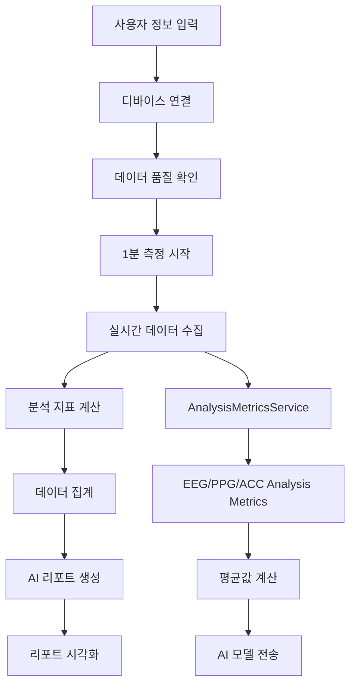

# AI Health Report 생성 기능 구현 기획서

## 📋 프로젝트 개요

### 목표
사용자가 LINK BAND 디바이스를 통해 1분간 측정한 EEG, PPG, ACC 데이터를 기반으로 AI가 생성하는 개인 맞춤형 건강 리포트 제공

### 전체 UX 흐름
```
사용자 정보 입력 → 디바이스 연결 → 착용 및 데이터 품질 확인 → 1분 측정 → 분석 대기 → 리포트 시각화
```

## 🏗️ 1. 아키텍처 설계

### 1.1 프로젝트 구조 배치
```
src/
├── domains/
│   └── ai-report/
│       ├── components/
│       │   ├── AIHealthReportApp.tsx          # 메인 앱 컴포넌트
│       │   ├── PersonalInfoScreen.tsx         # 사용자 정보 입력
│       │   ├── DeviceConnectionScreen.tsx     # 디바이스 연결 (새로 생성)
│       │   ├── DataQualityScreen.tsx          # 착용 및 데이터 품질 확인
│       │   ├── MeasurementScreen.tsx          # 1분 측정 화면
│       │   ├── AnalysisScreen.tsx             # 분석 대기 화면
│       │   └── ReportScreen.tsx               # 리포트 시각화
│       ├── hooks/
│       │   ├── usePersonalInfo.ts             # 사용자 정보 관리
│       │   ├── useDeviceConnection.ts         # 디바이스 연결 상태
│       │   ├── useMeasurementSession.ts       # 측정 세션 관리
│       │   └── useReportGeneration.ts         # 리포트 생성
│       ├── services/
│       │   ├── AnalysisMetricsService.ts      # 기존 - 분석 지표 계산
│       │   ├── ReportGenerationService.ts     # 새로 생성 - 리포트 생성
│       │   └── PersonalInfoService.ts         # 새로 생성 - 사용자 정보 관리
│       ├── types/
│       │   ├── index.ts                       # 기존 타입들
│       │   ├── report.ts                      # 리포트 관련 타입
│       │   └── measurement.ts                 # 측정 관련 타입
│       └── utils/
│           ├── dataAggregation.ts             # 데이터 집계 유틸리티
│           └── reportValidation.ts            # 리포트 검증 유틸리티
└── temp_disabled/ (기존 컴포넌트 활용)
    ├── DeviceManager.tsx                      # 활용: DeviceConnectionScreen
    └── Visualizer/                           # 활용: DataQualityScreen
```

### 1.2 기존 컴포넌트 활용 방안

#### temp_disabled/DeviceManager.tsx
- **활용 목적**: DeviceConnectionScreen에서 디바이스 연결 로직 재활용
- **주요 기능**: 디바이스 스캔, 연결, 상태 모니터링
- **이전 위치**: `src/domains/ai-report/components/DeviceConnectionScreen.tsx`

#### temp_disabled/Visualizer/
- **활용 목적**: DataQualityScreen에서 실시간 데이터 시각화
- **주요 기능**: EEG, PPG, ACC 데이터의 실시간 그래프 표시
- **이전 위치**: `src/domains/ai-report/components/DataQualityScreen.tsx`

## 📊 2. 데이터 연결 및 흐름 구성

### 2.1 데이터 흐름 다이어그램


### 2.2 데이터 집계 방식

#### 2.2.1 측정 중 실시간 데이터 수집
```typescript
// 1분 측정 동안 수집되는 데이터
interface MeasurementSession {
  startTime: number;
  endTime: number;
  duration: 60000; // 1분 = 60초
  
  // EEG 분석 지표들 (매초 수집)
  eegMetrics: EEGAnalysisMetrics[];
  
  // PPG 분석 지표들 (매초 수집)
  ppgMetrics: PPGAnalysisMetrics[];
  
  // ACC 분석 지표들 (매초 수집)
  accMetrics: ACCAnalysisMetrics[];
  
  // 데이터 품질 정보
  qualityAssessment: {
    eegQuality: number;
    ppgQuality: number;
    accQuality: number;
    overallQuality: number;
  };
}
```

#### 2.2.2 AI 모델 전송 데이터 형식
```typescript
// 1분 측정 완료 후 평균값 계산하여 AI에 전송
interface AIReportRequest {
  personalInfo: PersonalInfo;
  measurementSummary: {
    // EEG 지표 평균값
    eegSummary: {
      totalPower: number;
      emotionalBalance: number;
      attention: number;
      cognitiveLoad: number;
      focusIndex: number;
      relaxationIndex: number;
      stressIndex: number;
      hemisphericBalance: number;
      emotionalStability: number;
      attentionLevel: number;
      meditationLevel: number;
    };
    
    // PPG 지표 평균값
    ppgSummary: {
      bpm: number;
      sdnn: number;
      rmssd: number;
      pnn50: number;
      lfPower: number;
      hfPower: number;
      lfHfRatio: number;
      stressIndex: number;
      spo2: number;
      avnn: number;
      pnn20: number;
      sdsd: number;
      hrMax: number;
      hrMin: number;
    };
    
    // ACC 지표 평균값
    accSummary: {
      activityState: string;
      intensity: number;
      stability: number;
      avgMovement: number;
      maxMovement: number;
    };
    
    // 품질 지표
    qualitySummary: {
      eegQuality: number;
      ppgQuality: number;
      accQuality: number;
      overallQuality: number;
    };
  };
  timestamp: number;
}
```

## 🎯 3. 단계별 구현 계획

### Phase 1: 기본 UI 구조 및 라우팅 (1일)

#### 3.1 메인 앱 컴포넌트 생성
```typescript
// src/domains/ai-report/components/AIHealthReportApp.tsx
export function AIHealthReportApp() {
  const [currentStep, setCurrentStep] = useState<'info' | 'connection' | 'quality' | 'measurement' | 'analysis' | 'report'>('info');
  const [personalInfo, setPersonalInfo] = useState<PersonalInfo | null>(null);
  const [measurementData, setMeasurementData] = useState<MeasurementSession | null>(null);
  const [reportData, setReportData] = useState<AIReport | null>(null);
  
  // 단계별 컴포넌트 렌더링 로직
}
```

#### 3.2 기본 화면 컴포넌트들 생성
- PersonalInfoScreen: 외부 애플리케이션에서 가져와 수정
- DeviceConnectionScreen: temp_disabled/DeviceManager 기반 생성
- DataQualityScreen: temp_disabled/Visualizer 기반 생성
- MeasurementScreen: 외부 애플리케이션에서 가져와 수정
- AnalysisScreen: 외부 애플리케이션에서 가져와 수정
- ReportScreen: 새로 생성

### Phase 2: 디바이스 연결 기능 구현 (1-2일)

#### 3.3 DeviceConnectionScreen 구현
```typescript
// src/domains/ai-report/components/DeviceConnectionScreen.tsx
export function DeviceConnectionScreen({ onConnectionSuccess, onBack }) {
  // temp_disabled/DeviceManager의 로직 활용
  // - 디바이스 스캔 기능
  // - 자동 연결 기능
  // - 연결 상태 모니터링
  // - 브라우저 호환성 체크
}
```

#### 3.4 useDeviceConnection 훅 생성
```typescript
// src/domains/ai-report/hooks/useDeviceConnection.ts
export function useDeviceConnection() {
  // 기존 stores의 deviceStore, systemStore 활용
  // 연결 상태, 디바이스 정보, 연결/해제 함수 제공
}
```

### Phase 3: 데이터 품질 확인 기능 구현 (1-2일)

#### 3.5 DataQualityScreen 구현
```typescript
// src/domains/ai-report/components/DataQualityScreen.tsx
export function DataQualityScreen({ onQualityConfirmed, onBack }) {
  // temp_disabled/Visualizer 컴포넌트들 활용
  // - 실시간 EEG, PPG, ACC 그래프
  // - SQI (신호 품질 지수) 표시
  // - 착용 상태 가이드
  // - 품질 임계값 도달 시 다음 단계 진행 허용
}
```

#### 3.6 데이터 품질 평가 기준
- EEG SQI ≥ 80%
- PPG SQI ≥ 80%
- ACC 신호 안정성 확인
- 최소 10초간 안정적인 신호 유지

### Phase 4: 1분 측정 기능 구현 (2일)

#### 3.7 MeasurementScreen 개선
```typescript
// src/domains/ai-report/components/MeasurementScreen.tsx
export function MeasurementScreen({ personalInfo, onMeasurementComplete, onBack }) {
  // 외부 애플리케이션의 MeasurementScreen 기반
  // - 60초 카운트다운
  // - 실시간 데이터 시각화
  // - 분석 지표 실시간 계산 및 저장
  // - 측정 완료 시 데이터 집계
}
```

#### 3.8 useMeasurementSession 훅 생성
```typescript
// src/domains/ai-report/hooks/useMeasurementSession.ts
export function useMeasurementSession() {
  // 측정 세션 관리
  // - 측정 시작/중지/일시정지
  // - 실시간 데이터 수집
  // - 분석 지표 계산 및 저장
  // - 데이터 품질 모니터링
}
```

#### 3.9 데이터 집계 서비스 구현
```typescript
// src/domains/ai-report/utils/dataAggregation.ts
export class DataAggregationService {
  // 1분간 수집된 분석 지표들의 평균값 계산
  // 품질이 낮은 데이터 필터링
  // AI 모델 전송 형식으로 변환
}
```

### Phase 5: AI 리포트 생성 기능 구현 (2-3일)

#### 3.10 ReportGenerationService 구현
```typescript
// src/domains/ai-report/services/ReportGenerationService.ts
export class ReportGenerationService {
  // 외부 애플리케이션의 GeminiAIService 기반
  // - 개인정보와 측정 데이터를 AI 모델에 전송
  // - 리포트 생성 및 검증
  // - 에러 처리 및 재시도 로직
}
```

#### 3.11 AnalysisScreen 구현
```typescript
// src/domains/ai-report/components/AnalysisScreen.tsx
export function AnalysisScreen({ measurementData, onAnalysisComplete, onBack }) {
  // 분석 진행 상태 표시
  // - 로딩 애니메이션
  // - 진행 단계 표시
  // - 예상 소요 시간 표시
  // - 에러 발생 시 재시도 옵션
}
```

### Phase 6: 리포트 시각화 기능 구현 (2일)

#### 3.12 ReportScreen 구현
```typescript
// src/domains/ai-report/components/ReportScreen.tsx
export function ReportScreen({ reportData, onRestart, onSave }) {
  // 외부 애플리케이션의 ReportDetailScreen 기반
  // - AI 생성 리포트 시각화
  // - 차트 및 그래프 표시
  // - PDF 다운로드 기능
  // - 히스토리 저장 기능
}
```

## 🔧 4. 기술적 구현 세부사항

### 4.1 데이터 스토어 연결
```typescript
// 기존 스토어들과의 연결
import { useDeviceStore } from '@/stores/deviceStore';
import { useSystemStore } from '@/stores/systemStore';
import { useProcessedDataStore } from '@/stores/processedDataStore';
import { AnalysisMetricsService } from '@/domains/ai-report/services/AnalysisMetricsService';
```

### 4.2 실시간 데이터 처리
- AnalysisMetricsService를 통한 분석 지표 실시간 계산
- 품질 기반 필터링으로 정확한 데이터만 집계
- 메모리 효율적인 데이터 관리

### 4.3 AI 모델 통합
- 외부 애플리케이션의 GeminiAIService 활용
- 개인정보 보호를 위한 데이터 암호화
- API 에러 처리 및 재시도 로직

### 4.4 사용자 경험 개선
- 각 단계별 명확한 안내 메시지
- 진행 상황 시각화
- 에러 상황에 대한 친화적인 피드백
- 접근성 고려한 UI/UX

## 📈 5. 성능 및 품질 관리

### 5.1 데이터 품질 관리
- SQI 기반 실시간 품질 모니터링
- 품질 저하 시 사용자 안내
- 품질이 낮은 구간 데이터 제외

### 5.2 메모리 관리
- 실시간 데이터의 효율적인 버퍼링
- 측정 완료 후 불필요한 데이터 정리
- 메모리 사용량 모니터링

### 5.3 에러 처리
- 네트워크 오류 시 재시도 로직
- 디바이스 연결 실패 시 복구 절차
- AI 서비스 오류 시 대체 방안

## 🚀 6. 배포 및 테스트 계획

### 6.1 단계별 테스트
- Phase별 기능 테스트
- 통합 테스트
- 사용성 테스트
- 성능 테스트

### 6.2 사용자 피드백 수집
- 베타 테스트 진행
- 사용자 경험 개선
- 리포트 품질 검증

## 📅 7. 개발 일정

| Phase | 기간 | 주요 작업 |
|-------|------|----------|
| Phase 1 | 1일 | 기본 UI 구조 및 라우팅 |
| Phase 2 | 1-2일 | 디바이스 연결 기능 |
| Phase 3 | 1-2일 | 데이터 품질 확인 기능 |
| Phase 4 | 2일 | 1분 측정 기능 |
| Phase 5 | 2-3일 | AI 리포트 생성 기능 |
| Phase 6 | 2일 | 리포트 시각화 기능 |
| **총계** | **9-12일** | **완전한 기능 구현** |

## 🎯 8. 성공 지표

### 8.1 기능적 지표
- 디바이스 연결 성공률 ≥ 95%
- 데이터 품질 만족률 ≥ 90%
- 리포트 생성 성공률 ≥ 95%
- 전체 프로세스 완료율 ≥ 85%

### 8.2 사용자 경험 지표
- 단계별 이탈률 ≤ 10%
- 사용자 만족도 ≥ 4.0/5.0
- 프로세스 완료 시간 ≤ 5분

이 기획서를 바탕으로 단계적으로 구현하여 사용자에게 완전한 AI Health Report 생성 경험을 제공할 수 있습니다. 