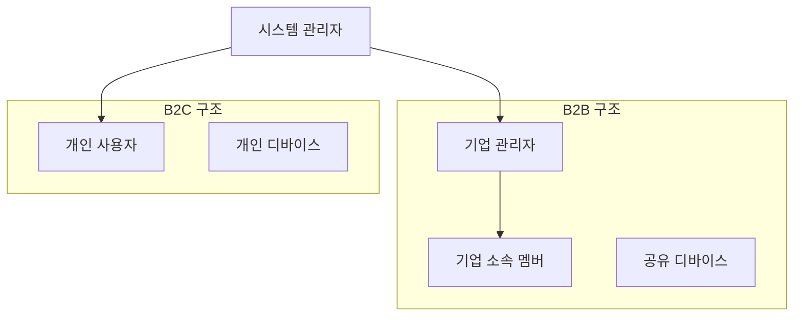
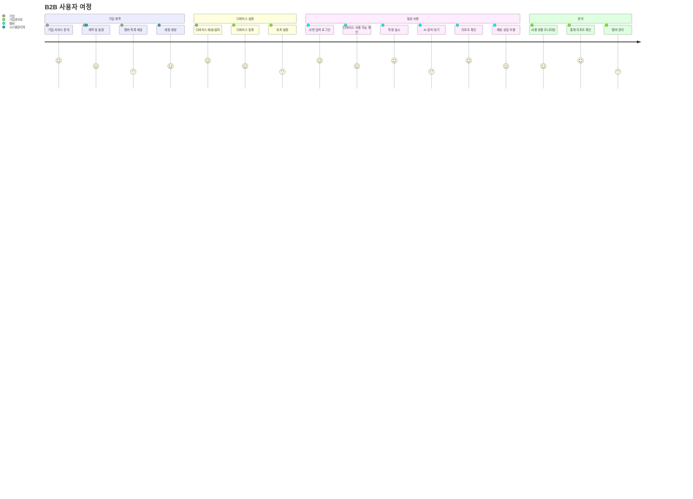
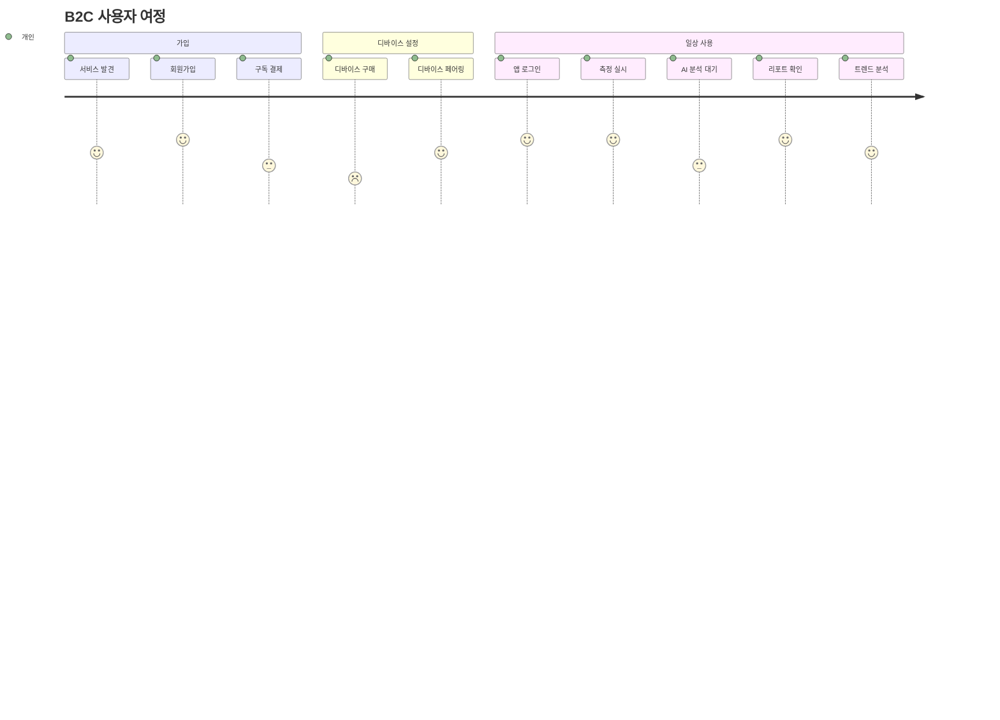

# Mind Breeze AI Report - B2B/B2C 서비스 아키텍처 기획서

## 📋 비즈니스 모델 개요

### 🏢 B2B (기업고객) 서비스
- **주요 고객**: 잇올, 파크로쉬, 카이스트, 군부대 등 기업/기관
- **서비스 형태**: 리포트 건수 기반 + 디바이스 렌탈 분리 모델
- **과금 구조**:
  - **기본 서비스**: 건당 7,900원 (AI 리포트 발행 1건 + 기본 AI 상담 1건 포함)
  - **볼륨 할인 체계**:
    - 100명 이상 500명 이하: 10% 할인 → 7,110원/건
    - 500명 이상 1000명 이하: 20% 할인 → 6,320원/건  
    - 1000명 이상 5000명 이하: 25% 할인 → 5,925원/건
    - 5000명 이상: 30% 할인 → 5,530원/건
  - **디바이스 렌탈**: 1개월 70,000원, 3개월 150,000원, 6개월 210,000원
  - **디바이스 구매**: 일괄 297,000원
  - **체험 서비스**:
    - **무료 체험**: 디바이스 구매시 5회 리포트 + 기본 상담 무료 제공 (39,500원 상당)
    - **유료 체험**: 1개월 렌탈 + 10회 리포트 = 100,000원 (149,000원 상당, 33% 할인)
  - **추가 AI 상담**: 1일 2,900원 / 1개월 14,900원
- **특징**:
  - **올인원 패키지**: 리포트 + 기본 상담이 하나의 서비스로 제공
  - **스케일 할인**: 규모가 클수록 최대 30%까지 할인 혜택
  - **체험 서비스**: 무료/유료 체험으로 리스크 없는 서비스 경험
  - **관리 단순화**: 디바이스 추적 불필요, 크레딧 기반 과금
  - **대량 인센티브**: 1000명 이상시 디바이스 무상 렌탈 (최대 3개월)
  - **간편 접근**: 사번/군번 등 기본 ID로 즉시 이용 가능
  - **예측 가능한 비용**: 명확한 건당 과금으로 예산 계획 용이
  - **전환 보너스**: 체험 후 정식 계약시 추가 할인 제공

### 👤 B2C (개인고객) 서비스
- **주요 고객**: 개별 소비자
- **서비스 형태**: 개인 구독 서비스
- **특징**:
  - 개별 회원가입/로그인
  - 개인 디바이스 소유
  - 일상적 사용
  - 개인 맞춤 분석 리포트

---

## 🏗️ 시스템 아키텍처 설계

### 1. 사용자 권한 체계



#### 권한 레벨
1. **시스템 관리자** (Super Admin)
   - 전체 시스템 관리
   - 기업 계약 관리
   - 개인 사용자 관리

2. **기업 관리자** (Enterprise Admin)
   - 소속 멤버 관리
   - 디바이스 할당 관리
   - 기업별 대시보드 접근
   - 통계 및 리포트 조회

3. **기업 소속 멤버** (Enterprise Member)
   - 측정 및 AI 분석 이용
   - 개인 리포트 조회
   - 채팅 상담 이용

4. **개인 사용자** (Individual User)
   - 개인 계정 관리
   - 개인 디바이스 관리
   - 개인 리포트 조회

### 2. 데이터베이스 스키마 재설계

#### 기존 스키마 문제점
- 개인 사용자 중심 설계
- 기업-멤버 관계 부재
- 디바이스 공유 개념 없음

#### 새로운 스키마 구조

```sql
-- 조직 정보 (리포트 건수 기반)
type Organization @table {
  id: UUID!
  name: String!
  type: OrganizationType! # ENTERPRISE | INDIVIDUAL
  contractType: ContractType! # REPORT_BASED | SUBSCRIPTION | FREE_TRIAL | PAID_TRIAL
  
  # 리포트 건수 기반 계약
  totalReportCredits: Int! # 전체 구매한 리포트 건수
  usedReportCredits: Int! # 사용한 리포트 건수
  remainingReportCredits: Int! # 남은 리포트 건수
  
  # 가격 정보
  basePrice: Float! # 기본 가격 (7,900원)
  discountRate: Float! # 할인율 (0.0 ~ 0.30)
  finalPricePerReport: Float! # 최종 리포트당 가격
  volumeTier: VolumeTier! # BASIC | SMALL | MEDIUM | LARGE | ENTERPRISE
  
  # 디바이스 렌탈 정보
  deviceRentalPlan: DeviceRentalPlan # NONE | MONTHLY | QUARTERLY | BIANNUAL | PURCHASE
  deviceCount: Int # 렌탈/구매한 디바이스 수
  deviceRentalStartDate: Date
  deviceRentalEndDate: Date
  deviceRentalCost: Float
  
  # 프로모션 정보
  isFreeDeviceEligible: Boolean! # 1000명 이상 무상 렌탈 자격
  freeDeviceEndDate: Date # 무상 렌탈 종료일
  
  # 체험 서비스 정보
  trialType: TrialType # NONE | FREE_WITH_DEVICE | PAID_TRIAL
  trialStartDate: Date
  trialEndDate: Date
  trialReportCredits: Int # 체험용 리포트 크레딧
  trialUsedCredits: Int # 사용한 체험 크레딧
  isTrialActive: Boolean! # 체험 서비스 활성 상태
  
  createdAt: Timestamp!
  isActive: Boolean!
  adminEmail: String!
  settings: OrganizationSettings
}

-- 사용자 정보 (통합)
type User @table {
  id: UUID!
  email: String
  employeeId: String # 사번/군번/학번
  name: String!
  organization: Organization!
  role: UserRole! # SYSTEM_ADMIN | ORG_ADMIN | ORG_MEMBER | INDIVIDUAL
  isActive: Boolean!
  createdAt: Timestamp!
  lastLoginAt: Timestamp
  profileData: UserProfile
}

-- 디바이스 관리 (단순화 - 추적 불필요)
type Device @table {
  id: UUID!
  serialNumber: String!
  organization: Organization!
  model: String!
  status: DeviceStatus! # ACTIVE | INACTIVE | MAINTENANCE
  rentalStartDate: Date
  rentalEndDate: Date
  location: String # 디바이스 위치 (선택적)
  lastMaintenance: Date
}

-- 측정 세션 (단순화)
type MeasurementSession @table {
  id: UUID!
  user: User!
  organization: Organization!
  startTime: Timestamp!
  endTime: Timestamp
  sessionType: SessionType! # SCHEDULED | ON_DEMAND
  measurementData: String # JSON 형태 센서 데이터
  rawDataFileUrl: String # 원본 데이터 파일 URL
}

-- AI 리포트 (크레딧 차감 시스템)
type AIHealthReport @table {
  id: UUID!
  user: User!
  organization: Organization!
  session: MeasurementSession!
  reportDate: Date!
  reportType: ReportType! # INDIVIDUAL | PERIODIC | COMPARATIVE
  analysisData: String # JSON 형태 분석 데이터
  recommendations: String
  
  # 크레딧 관리
  creditUsed: Boolean! # 크레딧 차감 여부
  creditAmount: Float! # 차감된 크레딧 금액 (할인 적용된 최종 가격)
  originalPrice: Float! # 원래 가격 (7,900원)
  discountApplied: Float! # 적용된 할인 금액
  
  isVisible: Boolean! # 개인 조회 가능 여부
  generatedAt: Timestamp!
}

-- 채팅 상담 (유료 모델)
type ChatConsultation @table {
  id: UUID!
  user: User!
  organization: Organization!
  startTime: Timestamp!
  endTime: Timestamp
  
  # 과금 정보
  isFreeConsultation: Boolean! # 무료 상담 여부 (기본 5건)
  consultationCost: Float # 유료 상담 비용
  billingType: BillingType # DAILY | MONTHLY
  
  messages: [ChatMessage]
  status: ChatStatus! # WAITING | ACTIVE | COMPLETED
  consultationType: ConsultationType! # AI | HUMAN
}

-- 사용자 채팅 크레딧 관리
type UserChatCredit @table {
  id: UUID!
  user: User!
  organization: Organization!
  
  # 무료 크레딧 (기본 5건)
  freeCreditsTotal: Int! # 기본 무료 크레딧 (5건)
  freeCreditsUsed: Int! # 사용한 무료 크레딧
  freeCreditsRemaining: Int! # 남은 무료 크레딧
  
  # 유료 구독
  paidSubscriptionType: PaidSubscriptionType # NONE | DAILY | MONTHLY
  paidSubscriptionStartDate: Date
  paidSubscriptionEndDate: Date
  paidSubscriptionCost: Float
  
  lastResetDate: Date # 무료 크레딧 리셋 날짜
}
```

### 3. 사용자 여정 (User Journey)

#### B2B 사용자 여정


#### B2C 사용자 여정


---

## 🔧 기술 구현 계획

### 1. 인증 시스템 확장

#### 현재 상태
- Firebase Authentication (이메일/비밀번호)
- 개인 사용자 중심

#### 개선 방향
```typescript
// 다중 인증 방식 지원
interface AuthMethod {
  type: 'EMAIL' | 'EMPLOYEE_ID' | 'SSO';
  organizationId?: string;
  employeeId?: string;
  email?: string;
}

// 조직별 인증 설정
interface OrganizationAuthSettings {
  authMethod: AuthMethod;
  allowSelfRegistration: boolean;
  requireEmailVerification: boolean;
  sessionTimeout: number;
}
```

### 2. 라우팅 구조 재설계

#### 새로운 라우팅 구조
```
/
├── /login
├── /signup
├── /enterprise-login          # 기업 로그인
├── /app
│   ├── /dashboard            # 통합 대시보드 (역할별 다른 화면)
│   ├── /measurement          # 측정 페이지
│   ├── /reports              # 리포트 페이지
│   ├── /consultation         # 상담 페이지
│   └── /admin                # 관리자 전용
│       ├── /organization     # 조직 관리
│       ├── /members          # 멤버 관리
│       ├── /devices          # 디바이스 관리
│       └── /analytics        # 통계 분석
└── /enterprise
    ├── /onboarding           # 기업 온보딩
    └── /settings             # 기업 설정
```

### 3. 컴포넌트 구조

#### 역할별 대시보드 컴포넌트
```typescript
// 통합 대시보드 컴포넌트
const Dashboard = () => {
  const { user } = useAuth();
  
  switch (user.role) {
    case 'SYSTEM_ADMIN':
      return <SystemAdminDashboard />;
    case 'ORG_ADMIN':
      return <OrganizationAdminDashboard />;
    case 'ORG_MEMBER':
      return <OrganizationMemberDashboard />;
    case 'INDIVIDUAL':
      return <IndividualDashboard />;
    default:
      return <UnauthorizedPage />;
  }
};
```

#### 디바이스 관리 컴포넌트
```typescript
// 공유 디바이스 관리
const SharedDeviceManager = () => {
  const { currentUser, availableDevices } = useDeviceStore();
  
  return (
    <div>
      <DeviceAvailabilityStatus />
      <DeviceReservationSystem />
      <DeviceUsageQueue />
    </div>
  );
};
```

---

## 📊 대시보드 설계

### 1. 시스템 관리자 대시보드
- 전체 조직 현황
- 구독 및 결제 관리
- 시스템 리소스 모니터링
- 사용량 통계

### 2. 기업 관리자 대시보드
- 소속 멤버 현황
- 디바이스 사용 현황
- 측정 완료율
- 상담 이용률
- 월간/분기별 리포트

### 3. 기업 멤버 대시보드
- 개인 측정 이력
- AI 분석 리포트
- 상담 예약 및 이력
- 개인 건강 트렌드

### 4. 개인 사용자 대시보드
- 개인 측정 데이터
- 장기 트렌드 분석
- 개인 맞춤 추천
- 목표 설정 및 달성도

---

## 🚀 구현 로드맵

### Phase 1: 기반 인프라 구축 (2주)
1. **데이터베이스 스키마 확장**
   - Organization, 확장된 User 테이블 추가
   - 기존 데이터 마이그레이션 계획
   
2. **인증 시스템 확장**
   - 다중 인증 방식 구현
   - 역할 기반 권한 시스템
   
3. **라우팅 구조 재설계**
   - 역할별 라우팅 가드
   - 조직별 접근 제어

### Phase 2: B2B 핵심 기능 구현 (3주)
1. **기업 관리자 기능**
   - 조직 설정 페이지
   - 멤버 관리 시스템
   - 디바이스 할당 관리
   
2. **공유 디바이스 시스템**
   - 디바이스 예약 시스템
   - 사용 대기열 관리
   - 실시간 사용 현황
   
3. **기업 대시보드**
   - 조직 현황 대시보드
   - 사용량 통계 및 분석
   - 리포트 생성 시스템

### Phase 3: B2C 기능 개선 (2주)
1. **개인 사용자 경험 개선**
   - 개선된 개인 대시보드
   - 장기 트렌드 분석
   - 개인 맞춤 추천 시스템

### Phase 4: 통합 및 최적화 (1주)
1. **성능 최적화**
2. **보안 강화**
3. **사용성 테스트**

---

## 🔐 보안 및 프라이버시

### 1. 데이터 접근 제어
- 조직별 데이터 격리
- 역할 기반 접근 제어 (RBAC)
- 개인정보 마스킹

### 2. 감사 로그
- 모든 관리자 행동 로깅
- 데이터 접근 기록
- 보안 이벤트 모니터링

### 3. 개인정보 보호
- 최소 권한 원칙
- 데이터 암호화
- 정기적 권한 검토

---

## 📈 성공 지표 (KPI)

### B2B 지표
- **수익 지표**:
  - 리포트 크레딧 판매량 (월간/분기별)
  - 디바이스 렌탈 수익
  - 유료 AI 상담 수익
  - 평균 계약 규모 (ACV - Annual Contract Value)

- **사용량 지표**:
  - 리포트 크레딧 사용률 (Used/Total %)
  - 멤버 측정 완료율
  - AI 상담 이용률 (무료 vs 유료)
  - 디바이스 활용도

- **고객 지표**:
  - 기업 계약 수 및 갱신율
  - 기업 만족도 (NPS)
  - 평균 멤버 수 per 기업

### B2C 지표  
- **수익 지표**:
  - 개인 구독 수익
  - 유료 AI 상담 수익
  - ARPU (Average Revenue Per User)

- **사용량 지표**:
  - 일일 활성 사용자 (DAU)
  - 월간 활성 사용자 (MAU) 
  - 개인 리포트 생성 빈도
  - 앱 사용 시간

- **고객 지표**:
  - 구독 갱신율
  - 이탈률 (Churn Rate)
  - 사용자 만족도

## 💰 볼륨 할인 체계 요약

| 규모 | 할인율 | 최종 단가 | 절약 금액 | 연간 5,000명 기준 총 절약 |
|------|--------|-----------|-----------|-------------------------|
| 1-99명 | 0% | 7,900원 | - | - |
| 100-499명 | 10% | 7,110원 | 790원/건 | 3,950,000원 |
| 500-999명 | 20% | 6,320원 | 1,580원/건 | 7,900,000원 |
| 1,000-4,999명 | 25% | 5,925원 | 1,975원/건 | 9,875,000원 |
| 5,000명+ | 30% | 5,530원 | 2,370원/건 | 11,850,000원 |

### 💡 **핵심 경쟁력**
- **대량 고객 우대**: 규모가 클수록 큰 혜택
- **명확한 ROI**: 할인 혜택이 투명하게 제시됨  
- **성장 인센티브**: 사용자 확대시 자동 할인 적용

## 💰 비즈니스 케이스 예시

### 대규모 기업 계약 (잇올 사례) - 10,000명
```
기본 서비스 (30% 할인 적용):
- 10,000건 × 5,530원 = 55,300,000원

디바이스 렌탈:
- 100대 × 1개월 × 70,000원 = 7,000,000원

총 계약금액: 62,300,000원
1인당 비용: 6,230원
할인 혜택: 23,700,000원 (38% 절약)
```

### 군부대 계약 (신병교육대 사례) - 300,000명  
```
기본 서비스 (30% 할인 적용):
- 300,000건 × 5,530원 = 1,659,000,000원

프로모션 적용:
- 디바이스 500대 × 3개월 무상 렌탈 (225,000,000원 상당)

총 계약금액: 1,659,000,000원  
1인당 비용: 5,530원
할인 혜택: 711,000,000원 (30% 절약)
```

### 중견 기업 계약 (800명 기업) - 20% 할인
```
기본 서비스 (20% 할인 적용):
- 800건 × 6,320원 = 5,056,000원

디바이스 렌탈:
- 10대 × 3개월 × 150,000원 = 1,500,000원

총 계약금액: 6,556,000원
1인당 비용: 8,195원  
할인 혜택: 1,264,000원 (20% 절약)
```

### 중소 기업 계약 (300명 기업) - 10% 할인
```
기본 서비스 (10% 할인 적용):
- 300건 × 7,110원 = 2,133,000원

디바이스 렌탈:
- 5대 × 3개월 × 150,000원 = 750,000원

총 계약금액: 2,883,000원
1인당 비용: 9,610원
할인 혜택: 237,000원 (10% 절약)
```

### 소규모 기업 계약 (50명 기업) - 할인 없음
```
기본 서비스 (정가):
- 50건 × 7,900원 = 395,000원

디바이스 렌탈:
- 2대 × 1개월 × 70,000원 = 140,000원

총 계약금액: 535,000원
1인당 비용: 10,700원
```

## 🎯 체험 서비스 케이스

### 무료 체험 (디바이스 구매 고객)
```
디바이스 구매:
- 1대 × 297,000원 = 297,000원

무료 체험 혜택:
- 5회 리포트 + 기본 상담 무료 (39,500원 상당)

실질 디바이스 비용: 257,500원 (13% 할인 효과)
```

### 유료 체험 패키지 (관망 중인 기업)
```
체험 패키지:
- 1개월 디바이스 렌탈 + 10회 리포트 = 100,000원

정가 대비:
- 디바이스 렌탈: 70,000원
- 10회 리포트: 79,000원  
- 총 정가: 149,000원

할인 혜택: 49,000원 (33% 절약)
체험 후 정식 계약 전환시 추가 10% 할인 적용
```

### 체험 → 정식 계약 전환 (200명 기업)
```
1단계: 유료 체험
- 체험 비용: 100,000원 (1개월)

2단계: 정식 계약 (10% 할인 + 체험 전환 보너스 10%)
- 200건 × 7,110원 × 0.9 = 1,279,800원
- 디바이스 5대 × 3개월 × 150,000원 = 750,000원

총 계약금액: 2,129,800원
체험 포함 총 비용: 2,229,800원
1인당 최종 비용: 11,149원

💡 체험 없이 바로 계약했다면: 12,365원/인 (약 10% 절약)
```

---

## 💡 향후 확장 계획

### 1. AI 기능 강화
- 조직별 맞춤 분석
- 예측 모델링
- 개인 맞춤 추천

### 2. 통합 시스템
- HR 시스템 연동
- 건강보험 연동
- 웨어러블 디바이스 연동

### 3. 글로벌 확장
- 다국어 지원
- 지역별 규제 준수
- 현지 파트너십

---

## 🚀 시스템 구현 로드맵

### Phase 1: 기반 인프라 구축 (1-2주)

#### 1.1 새로운 타입 시스템 구축
```typescript
// src/types/business.ts
export interface Organization {
  id: string;
  name: string;
  type: 'ENTERPRISE' | 'INDIVIDUAL';
  contractType: 'REPORT_BASED' | 'SUBSCRIPTION' | 'FREE_TRIAL' | 'PAID_TRIAL';
  
  // 크레딧 관리
  totalReportCredits: number;
  usedReportCredits: number;
  remainingReportCredits: number;
  
  // 할인 정보
  volumeTier: 'BASIC' | 'SMALL' | 'MEDIUM' | 'LARGE' | 'ENTERPRISE';
  discountRate: number;
  finalPricePerReport: number;
  
  // 체험 서비스
  trialType: 'NONE' | 'FREE_WITH_DEVICE' | 'PAID_TRIAL';
  trialReportCredits: number;
  trialUsedCredits: number;
  isTrialActive: boolean;
}

export interface User {
  id: string;
  email?: string;
  employeeId?: string; // 사번/군번/학번
  name: string;
  organization: Organization;
  role: 'SYSTEM_ADMIN' | 'ORG_ADMIN' | 'ORG_MEMBER' | 'INDIVIDUAL';
}
```

#### 1.2 인증 시스템 확장
```typescript
// src/services/EnterpriseAuthService.ts
class EnterpriseAuthService {
  // 사번/군번 기반 로그인
  async signInWithEmployeeId(organizationId: string, employeeId: string): Promise<User>
  
  // 조직별 사용자 목록 관리
  async createBulkUsers(organizationId: string, userList: BulkUserData[]): Promise<User[]>
  
  // 역할 기반 접근 제어
  async checkPermission(userId: string, resource: string, action: string): Promise<boolean>
}
```

#### 1.3 크레딧 관리 시스템
```typescript
// src/services/CreditManagementService.ts
class CreditManagementService {
  // 볼륨 할인 계산
  calculateVolumeDiscount(memberCount: number): DiscountInfo
  
  // 크레딧 차감
  async deductCredit(organizationId: string, userId: string, amount: number): Promise<Transaction>
  
  // 체험 크레딧 관리
  async activateTrial(organizationId: string, trialType: TrialType): Promise<TrialInfo>
}
```

### Phase 2: 홈페이지 및 UI 구현 (2-3주)

#### 2.1 랜딩 페이지 전면 개편

**기존 파일 수정 대상:**
- `src/components/landing/HeroSection.tsx`
- `src/components/landing/PricingSection.tsx`
- `src/components/landing/AIReportSection.tsx`

**새로운 컴포넌트 추가:**
```typescript
// src/components/landing/VolumeDiscountSection.tsx
export function VolumeDiscountSection() {
  // 볼륨 할인 체계 시각화
  // 인터랙티브 할인 계산기
}

// src/components/landing/TrialServiceSection.tsx  
export function TrialServiceSection() {
  // 무료/유료 체험 서비스 소개
  // 체험 신청 플로우
}

// src/components/landing/B2BShowcaseSection.tsx
export function B2BShowcaseSection() {
  // 기업 고객 사례 (잇올, 카이스트 등)
  // ROI 계산기
}
```

#### 2.2 새로운 페이지 구조
```
/
├── /                          # 새로운 랜딩 페이지
├── /enterprise                # 기업 고객 전용 페이지
│   ├── /pricing              # 기업 요금제 (볼륨 할인 포함)
│   ├── /trial                # 체험 서비스 신청
│   ├── /login                # 기업 로그인 (사번 기반)
│   └── /onboarding           # 기업 온보딩
├── /individual               # 개인 고객 페이지
│   ├── /pricing              # 개인 요금제
│   └── /login                # 개인 로그인
└── /app                      # 실제 서비스 앱
    ├── /dashboard            # 역할별 대시보드
    ├── /measurement          # 측정 서비스
    ├── /reports              # AI 리포트
    ├── /consultation         # AI 상담
    └── /admin                # 관리자 도구
```

#### 2.3 홈페이지 콘텐츠 수정 계획

**Hero Section 개편:**
```jsx
// Before: 일반적인 건강 관리 서비스
"AI 기반 개인 맞춤 건강 관리"

// After: B2B 중심 메시징
"기업 직원 웰니스 혁신 - 1인당 5,530원부터"
"대규모 계약시 최대 30% 할인 + 무료 체험"
```

**새로운 핵심 메시지:**
1. **"규모가 클수록 더 저렴하게"** - 볼륨 할인 강조
2. **"리스크 없는 체험"** - 무료/유료 체험 서비스
3. **"올인원 패키지"** - 리포트 + 상담 통합 서비스
4. **"관리 간편"** - 사번 기반 접근, 디바이스 추적 불필요

### Phase 3: 기업 관리 시스템 (2-3주)

#### 3.1 기업 관리자 대시보드
```typescript
// src/pages/admin/OrganizationDashboard.tsx
export function OrganizationDashboard() {
  return (
    <div>
      <CreditUsageChart />        {/* 크레딧 사용 현황 */}
      <MemberActivityGrid />      {/* 멤버별 활동 현황 */}
      <DeviceStatusPanel />       {/* 디바이스 현황 */}
      <ROICalculator />          {/* ROI 분석 도구 */}
      <BulkMemberManager />      {/* 대량 멤버 관리 */}
    </div>
  );
}
```

#### 3.2 체험 서비스 관리
```typescript
// src/components/trial/TrialManager.tsx
export function TrialManager() {
  return (
    <div>
      <TrialApplicationForm />    {/* 체험 신청 */}
      <TrialCreditTracker />     {/* 체험 크레딧 추적 */}
      <ConversionFlowHandler />  {/* 정식 전환 플로우 */}
    </div>
  );
}
```

### Phase 4: 측정 및 리포트 시스템 연동 (2주)

#### 4.1 크레딧 기반 리포트 생성
```typescript
// src/services/ReportGenerationService.ts
class ReportGenerationService {
  async generateReport(sessionData: SessionData, userId: string): Promise<AIReport> {
    // 1. 크레딧 확인
    await this.checkCredit(userId);
    
    // 2. AI 분석 실행
    const analysis = await this.runAIAnalysis(sessionData);
    
    // 3. 크레딧 차감
    await this.deductCredit(userId);
    
    // 4. 리포트 저장
    return await this.saveReport(analysis, userId);
  }
}
```

#### 4.2 AI 상담 통합
```typescript
// src/services/ConsultationService.ts
class ConsultationService {
  async startConsultation(userId: string, reportId: string): Promise<Consultation> {
    // 기본 상담 크레딧 확인
    // 리포트 기반 개인화된 상담 시작
  }
}
```

---

## 🎨 홈페이지 디자인 개편 계획

### 1. 새로운 Hero Section

**현재 버전:**
- 개인 사용자 중심
- 일반적인 건강 관리 메시징

**개편 후:**
```jsx
<HeroSection>
  <MainHeadline>
    기업 직원 멘탈 헬스케어의 새로운 기준
  </MainHeadline>
  <SubHeadline>
    1인당 5,530원부터 시작하는 AI 기반 종합 웰니스 솔루션
  </SubHeadline>
  <CTAButtons>
    <PrimaryButton>무료 체험 신청</PrimaryButton>
    <SecondaryButton>기업 상담 문의</SecondaryButton>
  </CTAButtons>
  <TrustIndicators>
    <CompanyLogos>잇올, 파크로쉬, 카이스트</CompanyLogos>
    <Stats>30만명+ 검사 완료, 15억원 규모 계약</Stats>
  </TrustIndicators>
</HeroSection>
```

### 2. 새로운 요금제 섹션

**인터랙티브 볼륨 할인 계산기:**
```jsx
<PricingCalculator>
  <EmployeeCountSlider min={50} max={50000} />
  <PricingBreakdown>
    <BasePrice>기본 단가: 7,900원</BasePrice>
    <DiscountRate>할인율: {discount}%</DiscountRate>
    <FinalPrice>최종 단가: {finalPrice}원</FinalPrice>
    <TotalSavings>연간 절약: {savings}원</TotalSavings>
  </PricingBreakdown>
</PricingCalculator>
```

### 3. 체험 서비스 섹션

```jsx
<TrialServiceSection>
  <TrialOptions>
    <FreeTrialCard>
      <Title>무료 체험</Title>
      <Description>디바이스 구매시 5회 리포트 무료</Description>
      <Value>39,500원 상당</Value>
    </FreeTrialCard>
    
    <PaidTrialCard>
      <Title>유료 체험</Title>
      <Description>1개월 렌탈 + 10회 리포트</Description>
      <Price>100,000원</Price>
      <OriginalPrice>149,000원</OriginalPrice>
      <Discount>33% 할인</Discount>
    </PaidTrialCard>
  </TrialOptions>
</TrialServiceSection>
```

### 4. B2B 고객 사례 섹션

```jsx
<B2BShowcaseSection>
  <CaseStudies>
    <CaseStudy company="잇올">
      <Stats>
        <Stat>10,000명 대상</Stat>
        <Stat>6,230원/인</Stat>
        <Stat>2,370만원 절약</Stat>
      </Stats>
    </CaseStudy>
    
    <CaseStudy company="군부대">
      <Stats>
        <Stat>300,000명 대상</Stat>
        <Stat>5,530원/인</Stat>
        <Stat>7억1천만원 절약</Stat>
      </Stats>
    </CaseStudy>
  </CaseStudies>
</B2BShowcaseSection>
```

---

## 📱 사용자 여정별 UI/UX 개선

### 1. 기업 고객 여정

**1단계: 랜딩 페이지 방문**
- 볼륨 할인 계산기로 즉시 ROI 확인
- 체험 서비스로 리스크 제거
- 기업 사례로 신뢰도 구축

**2단계: 체험 신청**
- 간단한 체험 신청 폼
- 즉시 디바이스 배송 안내
- 체험 기간 동안 적극적 지원

**3단계: 정식 계약**
- 체험 결과 기반 맞춤 제안
- 추가 할인 혜택 제공
- 온보딩 지원

### 2. 개인 고객 여정

**1단계: 서비스 발견**
- 개인 맞춤 메시징
- 간편한 회원가입

**2단계: 디바이스 구매**
- 무료 체험 크레딧 제공
- 사용법 가이드

**3단계: 지속적 사용**
- 개인화된 리포트
- 트렌드 분석

---

## 🔧 기술 구현 세부사항

### 1. 기존 파일 수정 목록

**인증 관련:**
- `src/components/AuthProvider.tsx` → 멀티 인증 지원
- `src/components/landing/LoginPage.tsx` → 기업/개인 로그인 분기
- `src/services/FirebaseService.ts` → 조직 관리 기능 추가

**랜딩 페이지:**
- `src/components/landing/HeroSection.tsx` → B2B 중심 메시징
- `src/components/landing/PricingSection.tsx` → 볼륨 할인 계산기
- `src/components/landing/AIReportSection.tsx` → 올인원 패키지 강조

**라우팅:**
- `src/components/AppRouter.tsx` → 새로운 라우트 추가
- `src/pages/*` → 역할별 페이지 추가

### 2. 새로운 파일 생성 목록

**비즈니스 로직:**
```
src/
├── types/
│   └── business.ts                    # 비즈니스 타입 정의
├── services/
│   ├── EnterpriseAuthService.ts      # 기업 인증
│   ├── CreditManagementService.ts    # 크레딧 관리  
│   ├── VolumeDiscountService.ts      # 할인 계산
│   └── TrialService.ts               # 체험 관리
├── components/
│   ├── enterprise/
│   │   ├── OrganizationDashboard.tsx
│   │   ├── MemberManager.tsx
│   │   └── CreditTracker.tsx
│   ├── trial/
│   │   ├── TrialApplicationForm.tsx
│   │   └── TrialManager.tsx
│   └── landing/
│       ├── VolumeDiscountSection.tsx
│       ├── TrialServiceSection.tsx
│       └── B2BShowcaseSection.tsx
└── pages/
    ├── enterprise/
    │   ├── EnterpriseLoginPage.tsx
    │   ├── EnterprisePricingPage.tsx
    │   └── TrialApplicationPage.tsx
    └── admin/
        ├── OrganizationManagementPage.tsx
        └── SystemAdminDashboard.tsx
```

이 기획서를 바탕으로 단계적으로 B2B/B2C 통합 서비스를 구축하고 홈페이지를 전면 개편하여 새로운 비즈니스 모델을 완벽하게 구현할 수 있을 것입니다. 