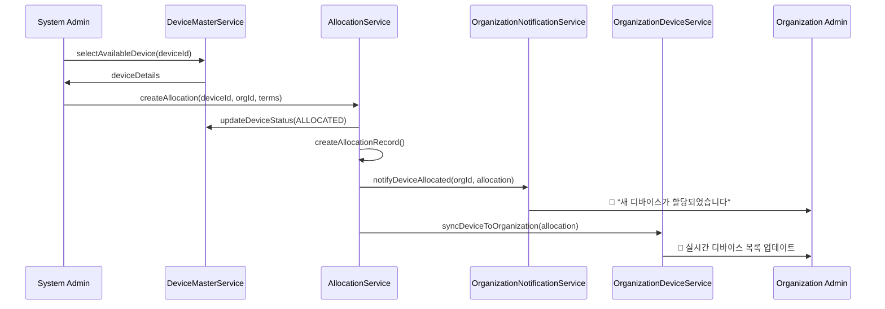
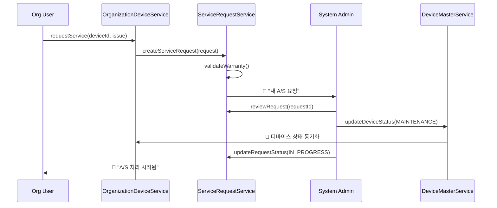

# 통합 디바이스 관리 시스템 설계 문서

## 📋 프로젝트 개요

시스템 관리자의 디바이스 배정(렌탈/판매)과 기업 디바이스 관리 시스템 간의 완전 통합 아키텍처 설계

### 핵심 목표
- ✅ 시스템 관리자 디바이스 배정 → 기업 디바이스 목록 실시간 반영
- ✅ 렌탈/판매 정보 완전 추적
- ✅ A/S 요청 시스템 통합
- ✅ 단일 진실의 원천 (Single Source of Truth) 구현

## 🏗️ 통합 아키텍처 설계

### 핵심 설계 원칙
1. **단일 진실의 원천**: 디바이스 상태는 중앙에서 관리
2. **실시간 동기화**: 시스템 관리자 액션 → 기업 자동 반영
3. **완전한 추적성**: 렌탈/판매부터 A/S까지 전 생애주기 추적
4. **권한 기반 접근**: 시스템/기업/사용자별 적절한 권한 분리

## 📊 통합 데이터 스키마 설계

### 1. Core Device Master (중앙 디바이스 마스터)
```typescript
interface DeviceMaster {
  // 기본 정보
  id: string                        // LXB-YYYYMMDD-XXX
  serialNumber: string
  deviceType: 'LINK_BAND_2.0' | 'LINK_BAND_3.0'
  model: string
  firmwareVersion: string
  
  // 제조/구매 정보
  manufacturingDate: Date
  purchaseCost: number
  supplier: string
  warrantyPeriodMonths: number
  registrationDate: Date
  
  // 현재 상태
  currentStatus: DeviceLifecycleStatus
  currentLocation: string
  lastStatusUpdate: Date
  
  // 할당 정보
  currentAllocation?: DeviceAllocation
  allocationHistory: DeviceAllocation[]
  
  // 기술적 상태
  batteryHealth: number
  lastCalibration: Date
  nextMaintenanceDate: Date
  
  // 메타데이터
  tags: string[]
  notes: string
  createdAt: Date
  updatedAt: Date
}

type DeviceLifecycleStatus = 
  | 'INVENTORY'      // 재고 (배정 가능)
  | 'ALLOCATED'      // 기업 할당됨
  | 'IN_USE'         // 실제 사용 중
  | 'MAINTENANCE'    // 점검/수리 중
  | 'RECALLED'       // 회수됨
  | 'RETIRED'        // 폐기됨
  | 'LOST'          // 분실됨
```

### 2. Device Allocation (디바이스 할당 정보)
```typescript
interface DeviceAllocation {
  id: string
  deviceId: string
  organizationId: string
  organizationName: string
  
  // 할당 타입 및 조건
  allocationType: 'RENTAL' | 'SALE'
  
  // 렌탈 정보
  rentalPeriodMonths?: number
  monthlyFee?: number
  rentalStartDate?: Date
  rentalEndDate?: Date
  
  // 판매 정보
  salePrice?: number
  saleDate?: Date
  warrantyEndDate?: Date
  
  // 계약 정보
  contractId: string
  contactPerson: {
    name: string
    email: string
    phone: string
    role: string
  }
  
  // 상태 및 추적
  status: AllocationStatus
  assignedUserId?: string      // 기업 내 사용자 할당
  assignedUserName?: string
  location?: string            // 기업 내 위치
  
  // 메타데이터
  createdAt: Date
  updatedAt: Date
  createdBy: string           // 시스템 관리자 ID
}

type AllocationStatus = 
  | 'ACTIVE'         // 활성 할당
  | 'PENDING_SETUP'  // 설정 대기
  | 'SUSPENDED'      // 일시 중단
  | 'EXPIRED'        // 기간 만료
  | 'TERMINATED'     // 조기 종료
```

### 3. Service Request (A/S 요청 통합)
```typescript
interface ServiceRequest {
  id: string
  deviceId: string
  organizationId: string
  allocationId: string        // 할당 정보 참조
  
  // 요청 정보
  requestType: ServiceRequestType
  priority: 'LOW' | 'MEDIUM' | 'HIGH' | 'CRITICAL'
  description: string
  issueCategory: IssueCategory[]
  
  // 요청자 정보
  requestedBy: {
    userId: string
    name: string
    email: string
    phone: string
    role: string
  }
  
  // 처리 정보
  status: ServiceStatus
  assignedTechnician?: string
  estimatedResolutionDate?: Date
  actualResolutionDate?: Date
  
  // 비용 및 워런티
  isWarrantyEligible: boolean
  estimatedCost?: number
  actualCost?: number
  costApprovalStatus?: 'PENDING' | 'APPROVED' | 'REJECTED'
  
  // 추적 정보
  statusHistory: ServiceStatusHistory[]
  attachments: ServiceAttachment[]
  internalNotes: string[]      // 시스템 관리자 전용
  
  createdAt: Date
  updatedAt: Date
}

type ServiceRequestType = 
  | 'REPAIR'           // 수리
  | 'REPLACEMENT'      // 교체
  | 'CALIBRATION'      // 캘리브레이션
  | 'FIRMWARE_UPDATE'  // 펌웨어 업데이트
  | 'PREVENTIVE'       // 예방 점검
  | 'RETURN'           // 반납
  | 'REFUND'           // 환불

type IssueCategory = 
  | 'HARDWARE'         // 하드웨어 문제
  | 'SOFTWARE'         // 소프트웨어 문제
  | 'CONNECTIVITY'     // 연결 문제
  | 'BATTERY'          // 배터리 문제
  | 'SENSOR'           // 센서 문제
  | 'USER_ERROR'       // 사용자 오류
```

## 🔄 통합 플로우 설계

### 1. 디바이스 할당 플로우 (시스템 관리자 → 기업)



### 2. A/S 요청 플로우 (기업 → 시스템 관리자)



## 🗄️ Firestore 컬렉션 구조 최적화

### 최적화된 컬렉션 구조
```
📁 Root Collections:
├── deviceMaster/              # 중앙 디바이스 마스터 (단일 진실의 원천)
├── deviceAllocations/         # 할당 정보 (조직별 인덱싱)
├── serviceRequests/           # 통합 A/S 관리
├── organizations/
│   └── {organizationId}/
│       ├── deviceViews/       # 읽기 전용 디바이스 뷰
│       ├── userAssignments/   # 사용자별 디바이스 할당
│       └── usageAnalytics/    # 사용 통계
└── systemAdmin/
    ├── inventoryReports/      # 재고 보고서
    ├── allocationContracts/   # 계약 문서
    └── maintenanceSchedule/   # 점검 일정
```

### 컬렉션별 인덱스 전략
```typescript
// deviceMaster 인덱스
{
  currentStatus: 'asc',
  'currentAllocation.organizationId': 'asc',
  deviceType: 'asc',
  createdAt: 'desc'
}

// deviceAllocations 인덱스
{
  organizationId: 'asc',
  status: 'asc',
  allocationType: 'asc',
  createdAt: 'desc'
}

// serviceRequests 인덱스
{
  organizationId: 'asc',
  status: 'asc',
  priority: 'desc',
  createdAt: 'desc'
}
```

## 🔄 실시간 동기화 로직

### 1. Device Status Synchronization Service
```typescript
class DeviceSynchronizationService {
  /**
   * 시스템 관리자 액션 → 조직 뷰 자동 동기화
   */
  async syncDeviceStatusToOrganization(
    deviceId: string, 
    status: DeviceLifecycleStatus,
    metadata?: any
  ) {
    // 1. 디바이스 마스터 업데이트
    await this.updateDeviceMaster(deviceId, { currentStatus: status, ...metadata })
    
    // 2. 할당 정보 조회
    const allocation = await this.getAllocationByDeviceId(deviceId)
    if (!allocation) return
    
    // 3. 조직 디바이스 뷰 업데이트
    await this.updateOrganizationDeviceView(
      allocation.organizationId, 
      deviceId, 
      status
    )
    
    // 4. 실시간 알림 발송
    await this.notifyOrganization(allocation.organizationId, {
      type: 'DEVICE_STATUS_CHANGED',
      deviceId,
      oldStatus: allocation.status,
      newStatus: status,
      timestamp: new Date()
    })
  }
  
  /**
   * 조직 내 디바이스 할당 → 시스템 추적 업데이트
   */
  async syncUserAssignmentToSystem(
    organizationId: string,
    deviceId: string,
    userId?: string,
    location?: string
  ) {
    // 1. 할당 정보 업데이트
    await this.updateAllocation(organizationId, deviceId, {
      assignedUserId: userId,
      location,
      lastAssignmentUpdate: new Date()
    })
    
    // 2. 디바이스 마스터 메타데이터 업데이트
    await this.updateDeviceMaster(deviceId, {
      currentLocation: location,
      lastLocationUpdate: new Date()
    })
    
    // 3. 사용 이력 기록
    await this.recordUsageEvent(deviceId, {
      type: 'USER_ASSIGNMENT',
      userId,
      location,
      timestamp: new Date()
    })
  }
}
```

### 2. Real-time Notification System
```typescript
class DeviceNotificationService {
  /**
   * 조직별 실시간 디바이스 상태 알림
   */
  async setupOrganizationDeviceStream(organizationId: string) {
    return onSnapshot(
      query(
        collection(db, 'deviceAllocations'),
        where('organizationId', '==', organizationId),
        where('status', '==', 'ACTIVE')
      ),
      (snapshot) => {
        snapshot.docChanges().forEach((change) => {
          if (change.type === 'modified') {
            this.broadcastDeviceUpdate(organizationId, {
              deviceId: change.doc.data().deviceId,
              changeType: 'STATUS_UPDATE',
              newData: change.doc.data(),
              timestamp: new Date()
            })
          }
        })
      }
    )
  }
  
  /**
   * A/S 요청 상태 알림
   */
  async notifyServiceRequestUpdate(
    requestId: string,
    status: ServiceStatus,
    additionalInfo?: any
  ) {
    const request = await this.getServiceRequest(requestId)
    
    // 조직에게 알림
    await this.sendNotificationToOrganization(request.organizationId, {
      type: 'SERVICE_REQUEST_UPDATE',
      requestId,
      deviceId: request.deviceId,
      status,
      message: this.getStatusMessage(status),
      additionalInfo
    })
    
    // 시스템 관리자에게 알림 (필요시)
    if (status === 'ESCALATED' || status === 'CRITICAL') {
      await this.notifySystemAdmin({
        type: 'SERVICE_REQUEST_ESCALATION',
        requestId,
        organizationId: request.organizationId,
        priority: request.priority
      })
    }
  }
}
```

## 🛠️ 서비스 레이어 통합

### 1. Unified Device Management Service
```typescript
class UnifiedDeviceManagementService {
  constructor(
    private deviceMasterService: DeviceMasterService,
    private allocationService: AllocationService,
    private serviceRequestService: ServiceRequestService,
    private syncService: DeviceSynchronizationService
  ) {}
  
  /**
   * 시스템 관리자: 디바이스 할당
   */
  async allocateDeviceToOrganization(request: DeviceAllocationRequest) {
    const transaction = await db.runTransaction(async (t) => {
      // 1. 디바이스 상태 확인 및 예약
      const device = await this.deviceMasterService.reserveDevice(request.deviceId)
      
      // 2. 할당 레코드 생성
      const allocation = await this.allocationService.createAllocation(request)
      
      // 3. 디바이스 마스터 업데이트
      await this.deviceMasterService.updateAllocation(request.deviceId, allocation)
      
      // 4. 조직 뷰 동기화 (비동기)
      this.syncService.syncDeviceToOrganization(allocation).catch(console.error)
      
      return allocation
    })
    
    return transaction
  }
  
  /**
   * 조직: 디바이스 사용자 할당
   */
  async assignDeviceToUser(
    organizationId: string,
    deviceId: string,
    userId: string,
    location?: string
  ) {
    // 1. 권한 검증
    await this.validateOrganizationDeviceAccess(organizationId, deviceId)
    
    // 2. 사용자 할당 업데이트
    await this.updateUserAssignment(organizationId, deviceId, userId, location)
    
    // 3. 시스템 동기화
    await this.syncService.syncUserAssignmentToSystem(
      organizationId, deviceId, userId, location
    )
    
    // 4. 사용 이력 기록
    await this.recordDeviceUsage(deviceId, userId, 'ASSIGNED')
  }
  
  /**
   * 조직: A/S 요청 제출
   */
  async submitServiceRequest(request: CreateServiceRequestRequest) {
    // 1. 워런티 상태 확인
    const allocation = await this.allocationService.getByDeviceId(request.deviceId)
    const warrantyStatus = this.calculateWarrantyStatus(allocation)
    
    // 2. 서비스 요청 생성
    const serviceRequest = await this.serviceRequestService.createRequest({
      ...request,
      isWarrantyEligible: warrantyStatus.isEligible,
      estimatedCost: warrantyStatus.isEligible ? 0 : this.estimateServiceCost(request)
    })
    
    // 3. 디바이스 상태 업데이트 (필요시)
    if (request.urgency === 'CRITICAL') {
      await this.deviceMasterService.updateStatus(request.deviceId, 'MAINTENANCE')
      await this.syncService.syncDeviceStatusToOrganization(
        request.deviceId, 'MAINTENANCE'
      )
    }
    
    return serviceRequest
  }
}
```

## 📱 기업 디바이스 관리 UI 업데이트

### 통합된 디바이스 카드 컴포넌트
```typescript
interface UnifiedDeviceCardProps {
  device: {
    id: string
    name: string
    type: string
    status: DeviceLifecycleStatus
    allocation: DeviceAllocation
    assignedUser?: OrganizationUser
    batteryLevel?: number
    lastConnected?: Date
    serviceRequests?: ServiceRequest[]
  }
  onAssignUser: (deviceId: string, userId: string) => Promise<void>
  onRequestService: (deviceId: string) => void
  onViewDetails: (deviceId: string) => void
}

function UnifiedDeviceCard({ device, ...actions }: UnifiedDeviceCardProps) {
  const statusColor = getDeviceStatusColor(device.status)
  const isRental = device.allocation.allocationType === 'RENTAL'
  const hasActiveService = device.serviceRequests?.some(r => r.status !== 'COMPLETED')
  
  return (
    <Card className="relative">
      {/* 할당 타입 배지 */}
      <Badge className={`absolute top-3 right-3 ${isRental ? 'bg-blue-100' : 'bg-green-100'}`}>
        {isRental ? '렌탈' : '구매'}
      </Badge>
      
      {/* 디바이스 정보 */}
      <CardContent className="p-4">
        <div className="flex items-center gap-3 mb-3">
          <div className={`w-3 h-3 rounded-full ${statusColor}`} />
          <h3 className="font-medium">{device.name}</h3>
        </div>
        
        {/* 할당된 사용자 */}
        {device.assignedUser ? (
          <div className="flex items-center gap-2 mb-2">
            <User className="w-4 h-4 text-slate-400" />
            <span className="text-sm">{device.assignedUser.name}</span>
          </div>
        ) : (
          <Button size="sm" variant="outline" onClick={() => actions.onAssignUser(device.id, '')}>
            사용자 할당
          </Button>
        )}
        
        {/* A/S 상태 */}
        {hasActiveService && (
          <Alert className="mt-3">
            <AlertCircle className="w-4 h-4" />
            <AlertDescription>A/S 진행 중</AlertDescription>
          </Alert>
        )}
        
        {/* 액션 버튼 */}
        <div className="flex gap-2 mt-4">
          <Button size="sm" variant="outline" onClick={() => actions.onViewDetails(device.id)}>
            상세보기
          </Button>
          <Button size="sm" variant="outline" onClick={() => actions.onRequestService(device.id)}>
            A/S 요청
          </Button>
        </div>
      </CardContent>
    </Card>
  )
}
```

## 🎯 구현 우선순위

### Phase 1: 핵심 데이터 구조 (1-2일)
1. **DeviceMaster** 스키마 구현 및 마이그레이션
2. **DeviceAllocation** 구조 설계 및 인덱스 최적화
3. **ServiceRequest** 통합 모델 구현

### Phase 2: 서비스 레이어 통합 (2-3일)
1. **UnifiedDeviceManagementService** 핵심 메서드
2. **DeviceSynchronizationService** 실시간 동기화
3. 기존 서비스와의 호환성 유지

### Phase 3: UI 및 사용자 경험 (2-3일)
1. 기업 디바이스 관리 페이지 업데이트
2. 실시간 상태 표시 및 알림 시스템
3. A/S 요청 워크플로우 통합

### Phase 4: 테스트 및 최적화 (1-2일)
1. 데이터 마이그레이션 검증
2. 실시간 동기화 성능 테스트
3. 사용자 시나리오 테스트

## 📈 성공 지표

### 기능적 성공 지표
- ✅ 시스템 관리자 디바이스 배정 후 3초 이내 기업 목록 반영
- ✅ 렌탈/판매 정보 100% 정확성 유지
- ✅ A/S 요청 처리 시간 50% 단축
- ✅ 디바이스 생애주기 완전 추적 가능

### 기술적 성공 지표
- ✅ 실시간 동기화 지연 시간 < 5초
- ✅ 데이터 일관성 99.9% 유지
- ✅ API 응답 시간 < 500ms
- ✅ 동시 사용자 500명 지원

---

## 📝 개발 진행 상황

- [x] 현재 시스템 아키텍처 분석
- [x] 통합 데이터 스키마 설계
- [x] 플로우 및 동기화 로직 설계
- [ ] DeviceMaster 데이터 스키마 구현
- [ ] UnifiedDeviceManagementService 구현
- [ ] 실시간 동기화 시스템 구현
- [ ] 기업 디바이스 관리 UI 업데이트
- [ ] A/S 통합 시스템 구현
- [ ] 테스트 및 최적화

*최종 업데이트: 2024-01-22*