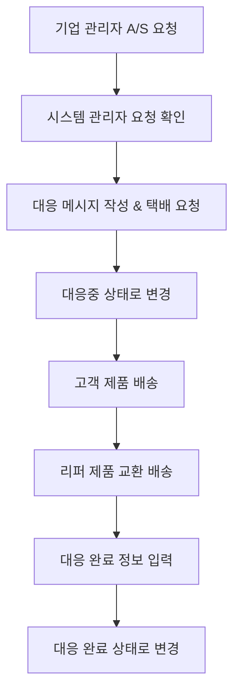

# 🏭 **디바이스 관리 시스템 완전 기획서**
> **체계적인 디바이스 라이프사이클 관리 시스템**

## 🎯 **시스템 개요**

### **완전한 디바이스 라이프사이클**
```
📦 재고 → 🎯 배정 → 📊 사용추적 → 🔄 회수(렌탈) / 🔧 A/S(구매)
```

### **6개 관리 탭 구조**
1. **🏠 전체 현황** - 시스템 대시보드 & 통계 분석
2. **📦 재고 관리** - 신규 등록 & 재고 현황 관리
3. **🎯 배정** - 기업별 배정 & 배정 이력 관리
4. **📊 사용 현황** - 실시간 사용 모니터링 & 분석
5. **🔄 렌탈관리** - 렌탈 기간 & 회수 스케줄 관리
6. **🔧 A/S** - 구매 제품 서비스 & 교체 관리

---

## 🗄️ **데이터 구조 설계**

### **1. 디바이스 재고 (DeviceInventory)**
```typescript
interface DeviceInventory {
  id: string; // 디바이스 시리얼 넘버 (예: "LXB-010414")
  deviceType: 'LINK_BAND_2.0' | 'LINK_BAND_3.0' | string; // 기본값: LINK_BAND_2.0
  registrationDate: Date; // 등록일자 (기본값: 오늘)
  status: 'AVAILABLE' | 'ASSIGNED' | 'IN_USE' | 'MAINTENANCE' | 'RETURNED' | 'DISPOSED';
  purchaseCost?: number; // 구매 비용
  supplier?: string; // 공급업체
  warrantyPeriod?: number; // 보증 기간 (개월)
  notes?: string; // 메모
  createdAt: Date;
  updatedAt: Date;
}
```

### **2. 디바이스 배정 (DeviceAssignment)**
```typescript
interface DeviceAssignment {
  id: string;
  deviceId: string; // DeviceInventory.id
  organizationId: string; // 배정된 기업
  assignmentType: 'RENTAL' | 'PURCHASE'; // 렌탈 or 구매
  rentalPeriod?: 1 | 3 | 6 | 12; // 렌탈 기간 (개월)
  startDate: Date; // 시작일 (기본값: 오늘)
  endDate?: Date; // 종료일 (렌탈의 경우 자동 계산)
  monthlyFee?: number; // 월 렌탈비
  purchasePrice?: number; // 구매 가격
  status: 'ACTIVE' | 'COMPLETED' | 'CANCELLED' | 'OVERDUE';
  assignedBy: string; // 배정한 관리자
  notes?: string;
  createdAt: Date;
  updatedAt: Date;
}
```

### **3. 디바이스 사용 추적 (DeviceUsageTracking)**
```typescript
interface DeviceUsageTracking {
  id: string;
  deviceId: string;
  assignmentId: string;
  organizationId: string;
  usageDate: Date;
  sessionCount: number; // 일일 세션 수
  totalUsageMinutes: number; // 총 사용 시간 (분)
  uniqueUsers: number; // 고유 사용자 수
  dataQuality: 'EXCELLENT' | 'GOOD' | 'FAIR' | 'POOR'; // 데이터 품질
  lastSyncTime: Date; // 마지막 동기화 시간
  batteryLevel?: number; // 배터리 잔량
  firmwareVersion?: string; // 펌웨어 버전
  createdAt: Date;
}
```

### **4. 렌탈 관리 (RentalManagement)**
```typescript
interface RentalManagement {
  id: string;
  assignmentId: string;
  deviceId: string;
  organizationId: string;
  rentalStartDate: Date;
  rentalEndDate: Date;
  returnScheduledDate: Date;
  actualReturnDate?: Date;
  returnStatus: 'SCHEDULED' | 'OVERDUE' | 'RETURNED' | 'EXTENDED';
  extensionRequests?: Array<{
    requestDate: Date;
    newEndDate: Date;
    reason: string;
    approved: boolean;
    approvedBy?: string;
  }>;
  returnCondition?: 'EXCELLENT' | 'GOOD' | 'DAMAGED' | 'LOST';
  returnNotes?: string;
  totalRentalFee: number;
  paidAmount: number;
  outstandingAmount: number;
  createdAt: Date;
  updatedAt: Date;
}
```

### **5. A/S 관리 (ServiceManagement)**
```typescript
interface ServiceManagement {
  id: string;
  deviceId: string;
  organizationId: string;
  assignmentId: string;
  serviceType: 'WARRANTY' | 'REPAIR' | 'REPLACEMENT' | 'MAINTENANCE' | 'UPGRADE';
  issueDescription: string;
  reportedDate: Date;
  reportedBy: string; // 신고자
  priority: 'LOW' | 'MEDIUM' | 'HIGH' | 'CRITICAL';
  status: 'REPORTED' | 'DIAGNOSED' | 'IN_PROGRESS' | 'COMPLETED' | 'CANCELLED';
  assignedTechnician?: string;
  estimatedCost?: number;
  actualCost?: number;
  serviceStartDate?: Date;
  serviceCompletionDate?: Date;
  replacementDeviceId?: string; // 교체 디바이스
  serviceNotes?: string;
  customerSatisfaction?: 1 | 2 | 3 | 4 | 5; // 고객 만족도
  createdAt: Date;
  updatedAt: Date;
}
```

---

## 🖥️ **UI 탭 구조 및 기능**

### **📊 Tab 1: 전체 현황**
**시스템 대시보드 & 통계 분석**

#### **핵심 지표 카드**
- **📦 총 재고**: 전체 디바이스 수량
- **🎯 배정률**: (배정된 디바이스 / 전체 재고) × 100
- **📈 사용률**: 실제 사용 중인 디바이스 비율
- **💰 월 수익**: 렌탈 + 구매 월간 수익

#### **실시간 차트**
- **디바이스 상태 분포** (도넛 차트)
- **월별 배정 트렌드** (라인 차트)
- **기업별 사용량 TOP 10** (바 차트)
- **A/S 요청 현황** (영역 차트)

#### **빠른 액션**
- ⚡ **긴급 재고 등록**
- 🚨 **연체 알림 확인**
- 📋 **오늘의 회수 일정**

### **📦 Tab 2: 재고 관리**
**신규 등록 & 재고 현황 관리**

#### **상단 액션 바**
- 🆕 **신규 디바이스 등록** (Modal)
- 📤 **벌크 등록** (Excel 업로드)
- 🔍 **재고 검색 & 필터**

#### **재고 등록 Modal**
```
┌─ 📝 신규 디바이스 등록 ─────────────────┐
│ 디바이스 이름*: [LXB-______] (auto)    │
│ 디바이스 종류*: [LINK BAND 2.0 ▼]      │
│ 등록일자*: [2024-01-15] (오늘)          │
│ 구매 비용: [_______원]                  │
│ 공급업체: [__________]                  │
│ 보증 기간: [12개월 ▼]                   │
│ 메모: [________________]               │
│                        [취소] [등록]    │
└─────────────────────────────────────┘
```

#### **재고 목록 테이블**
| 디바이스명 | 종류 | 등록일 | 상태 | 배정 |
|------------|------|--------|------|------|
| LXB-010414 | 링크밴드 2.0 | 2024-01-15 | 🟢 대기 | **배정** |
| LXB-010415 | 링크밴드 2.0 | 2024-01-15 | 🔵 배정완료 | 보기 |

### **🎯 Tab 3: 배정**
**기업별 배정 & 배정 이력 관리**

#### **배정 Modal**
```
┌─ 🎯 디바이스 배정 ─────────────────────┐
│ 디바이스: LXB-010414 (링크밴드 2.0)    │
│ 배정 기업*: [LOOXID LABS ▼]            │
│ 배정 유형*: ⚪렌탈 ⚪구매               │
│                                        │
│ [렌탈 선택시]                          │
│ 렌탈 기간*: ⚪1개월 ⚪3개월 ⚪6개월 ⚪12개월 │
│ 시작일*: [2024-01-15] (오늘)           │
│ 종료일: [2024-04-15] (자동계산)        │
│ 월 렌탈비: [50,000원]                  │
│                                        │
│ [구매 선택시]                          │
│ 구매 가격*: [______원]                 │
│                                        │
│ 메모: [________________]               │
│                        [취소] [배정]    │
└─────────────────────────────────────┘
```

#### **배정 현황 테이블**
| 디바이스 | 기업 | 유형 | 기간/가격 | 시작일 | 상태 | 액션 |
|----------|------|------|-----------|--------|------|------|
| LXB-010414 | LOOXID | 렌탈 | 3개월/15만원 | 01-15 | 🟢 활성 | 수정/해제 |

### **📊 Tab 4: 사용 현황**
**실시간 사용 모니터링 & 분석**

#### **사용량 지표**
- **📱 실시간 온라인**: 현재 사용 중인 디바이스
- **📈 오늘 사용량**: 금일 총 사용 시간
- **👥 활성 사용자**: 금일 사용한 고유 사용자
- **⚡ 데이터 품질**: 전체 디바이스 데이터 품질 평균

#### **사용 현황 테이블**
| 디바이스 | 기업 | 사용자 | 현재상태 | 최근사용 | 일일사용량 | 데이터품질 |
|----------|------|--------|----------|----------|------------|------------|
| LXB-010414 | LOOXID | 김철수 | 🟢 온라인 | 2분전 | 45분 | 🟢 우수 |

### **🔄 Tab 5: 렌탈관리**
**렌탈 기간 & 회수 스케줄 관리**

#### **렌탈 현황 대시보드**
- **📅 이번주 회수 예정**: 회수해야 할 디바이스 수
- **⚠️ 연체 디바이스**: 반납 기한이 지난 디바이스
- **📈 연장 요청**: 기간 연장 요청 대기
- **💰 미수금**: 렌탈비 미납 현황

#### **회수 스케줄 테이블**
| 디바이스 | 기업 | 회수예정일 | 상태 | 연장요청 | 액션 |
|----------|------|------------|------|----------|------|
| LXB-010414 | LOOXID | 2024-04-15 | 🟡 3일전 | - | 알림/연장 |
| LXB-010415 | Samsung | 2024-01-10 | 🔴 5일연체 | 1회 | **회수** |

#### **회수 처리 Modal**
```
┌─ 🔄 디바이스 회수 처리 ──────────────────┐
│ 디바이스: LXB-010414                   │
│ 기업: LOOXID LABS INC.                 │
│ 회수일*: [2024-01-20]                  │
│ 디바이스 상태*:                        │
│ ⚪우수 ⚪양호 ⚪손상 ⚪분실              │
│                                        │
│ 총 렌탈비: 150,000원                   │
│ 기납부액: 100,000원                    │
│ 미납액: 50,000원                       │
│                                        │
│ 회수 메모: [________________]          │
│                        [취소] [회수완료] │
└─────────────────────────────────────┘
```

### **🔧 Tab 6: A/S**
**구매 제품 서비스 & 교체 관리**

#### **A/S 현황 대시보드**
- **🎫 신규 접수**: 금일 새로 접수된 A/S
- **🔧 진행중**: 현재 처리 중인 A/S
- **✅ 완료**: 금주 완료된 A/S
- **📊 만족도**: 평균 고객 만족도

#### **A/S 접수 Modal**
```
┌─ 🔧 A/S 접수 ────────────────────────┐
│ 디바이스*: [LXB-010414 ▼]            │
│ 기업*: [LOOXID LABS ▼]                │
│ 서비스 유형*:                         │
│ ⚪보증 ⚪수리 ⚪교체 ⚪정기점검 ⚪업그레이드 │
│                                       │
│ 우선순위*: ⚪낮음 ⚪보통 ⚪높음 ⚪긴급    │
│                                       │
│ 문제 설명*:                           │
│ [_________________________________]  │
│ [_________________________________]  │
│                                       │
│ 신고자: [김철수]                      │
│ 예상 비용: [______원]                 │
│                        [취소] [접수]   │
└─────────────────────────────────────┘
```

#### **A/S 현황 테이블**
| 접수번호 | 디바이스 | 기업 | 서비스유형 | 우선순위 | 상태 | 담당자 | 액션 |
|----------|----------|------|------------|----------|------|--------|------|
| AS-001 | LXB-010414 | LOOXID | 수리 | 🔴 긴급 | 진행중 | 이영희 | 상세 |

---

## 🛠️ **서비스 클래스 구조**

### **1. DeviceInventoryService**
```typescript
class DeviceInventoryService extends BaseService<DeviceInventory> {
  // 기본 CRUD
  async createDevice(deviceData: Omit<DeviceInventory, 'id' | 'createdAt' | 'updatedAt'>): Promise<DeviceInventory>
  async getAllInventory(): Promise<DeviceInventory[]>
  async getAvailableDevices(): Promise<DeviceInventory[]>
  async updateDeviceStatus(deviceId: string, status: DeviceInventory['status']): Promise<void>
  
  // 통계
  async getInventoryStats(): Promise<{
    total: number;
    available: number;
    assigned: number;
    inUse: number;
    maintenance: number;
  }>
  
  // 벌크 등록
  async bulkCreateDevices(devices: Array<Omit<DeviceInventory, 'id' | 'createdAt' | 'updatedAt'>>): Promise<DeviceInventory[]>
}
```

### **2. DeviceAssignmentService**
```typescript
class DeviceAssignmentService extends BaseService<DeviceAssignment> {
  // 배정 관리
  async assignDevice(assignmentData: Omit<DeviceAssignment, 'id' | 'createdAt' | 'updatedAt'>): Promise<DeviceAssignment>
  async getActiveAssignments(): Promise<DeviceAssignment[]>
  async getAssignmentsByOrganization(orgId: string): Promise<DeviceAssignment[]>
  async cancelAssignment(assignmentId: string, reason: string): Promise<void>
  
  // 렌탈 기간 계산
  async calculateRentalEndDate(startDate: Date, periodMonths: number): Promise<Date>
  async getExpiringRentals(daysAhead: number): Promise<DeviceAssignment[]>
}
```

### **3. DeviceUsageTrackingService**
```typescript
class DeviceUsageTrackingService extends BaseService<DeviceUsageTracking> {
  // 사용량 기록
  async recordDailyUsage(usageData: Omit<DeviceUsageTracking, 'id' | 'createdAt'>): Promise<DeviceUsageTracking>
  async getRealtimeUsage(): Promise<DeviceUsageTracking[]>
  async getUsageByDevice(deviceId: string, dateRange: { start: Date; end: Date }): Promise<DeviceUsageTracking[]>
  
  // 분석
  async getUsageAnalytics(organizationId?: string): Promise<{
    totalSessions: number;
    totalMinutes: number;
    uniqueUsers: number;
    averageQuality: string;
  }>
}
```

### **4. RentalManagementService**
```typescript
class RentalManagementService extends BaseService<RentalManagement> {
  // 렌탈 관리
  async createRentalRecord(rentalData: Omit<RentalManagement, 'id' | 'createdAt' | 'updatedAt'>): Promise<RentalManagement>
  async getUpcomingReturns(daysAhead: number): Promise<RentalManagement[]>
  async getOverdueRentals(): Promise<RentalManagement[]>
  async processReturn(rentalId: string, returnData: { actualReturnDate: Date; returnCondition: RentalManagement['returnCondition']; returnNotes?: string }): Promise<void>
  
  // 연장 요청
  async requestExtension(rentalId: string, extensionData: { newEndDate: Date; reason: string }): Promise<void>
  async approveExtension(rentalId: string, extensionIndex: number, approvedBy: string): Promise<void>
}
```

### **5. ServiceManagementService**
```typescript
class ServiceManagementService extends BaseService<ServiceManagement> {
  // A/S 관리
  async createServiceRequest(serviceData: Omit<ServiceManagement, 'id' | 'createdAt' | 'updatedAt'>): Promise<ServiceManagement>
  async getActiveServices(): Promise<ServiceManagement[]>
  async assignTechnician(serviceId: string, technicianId: string): Promise<void>
  async updateServiceStatus(serviceId: string, status: ServiceManagement['status'], notes?: string): Promise<void>
  async completeService(serviceId: string, completionData: { actualCost?: number; customerSatisfaction?: number; serviceNotes?: string }): Promise<void>
  
  // 통계
  async getServiceStats(): Promise<{
    totalRequests: number;
    inProgress: number;
    completed: number;
    averageSatisfaction: number;
  }>
}
```

---

## 🛠️ **A/S 관리 시스템 완전 기획**

### **📋 A/S 프로세스 워크플로우**



### **🎭 A/S 상태 관리**

#### **1. 대응 대기 (PENDING)**
- 기업 관리자가 A/S 요청 생성
- 시스템 관리자 대응 대기 중
- **표시 정보:** 기업명, 담당자, 연락처, 이메일, 디바이스ID, 요청사유
- **액션:** "대응하기" 버튼

#### **2. 대응중 (IN_PROGRESS)**  
- 시스템 관리자가 대응 메시지 전송 완료
- 고객 제품 배송 & 리퍼 제품 준비 중
- **표시 정보:** 대응 시작일, 대응 메시지, 진행 상태
- **액션:** "대응 완료하기" 버튼

#### **3. 대응 완료 (COMPLETED)**
- 리퍼 제품 교환 완료
- A/S 프로세스 종료
- **표시 정보:** 결함내용, 대응방법, 완료일, 메모

### **💾 A/S 데이터 구조**

```typescript
// A/S 요청 정보
interface ServiceRequest {
  id: string;
  requestDate: Date;
  status: 'PENDING' | 'IN_PROGRESS' | 'COMPLETED';
  
  // 요청자 정보 (기업 관리자)
  organizationId: string;
  organizationName: string;
  requesterName: string;
  requesterEmail: string;
  requesterPhone: string;
  
  // 디바이스 정보
  deviceId: string;
  deviceModel: string;
  deviceSerialNumber: string;
  
  // 요청 내용
  issueDescription: string;
  urgencyLevel: 'LOW' | 'MEDIUM' | 'HIGH' | 'CRITICAL';
  
  // 대응 정보 (시스템 관리자)
  responseDate?: Date;
  responseMessage?: string;
  assignedTechnicianId?: string;
  assignedTechnicianName?: string;
  
  // 완료 정보
  completionDate?: Date;
  defectDescription?: string;  // 결함 내용
  resolutionMethod: string;    // 대응 방법 (기본: "리퍼제품 교환")
  resolutionNotes?: string;    // 메모
  replacementDeviceId?: string; // 교체된 리퍼 제품 ID
  
  // 시스템 정보
  createdAt: Date;
  updatedAt: Date;
}

// A/S 통계 정보
interface ServiceStatistics {
  totalRequests: number;
  pendingRequests: number;
  inProgressRequests: number;
  completedRequests: number;
  averageResolutionTime: number; // 평균 처리 시간 (일)
  urgentRequests: number;
  monthlyRequestTrend: Array<{
    month: string;
    requests: number;
    completed: number;
  }>;
  topIssueTypes: Array<{
    issueType: string;
    count: number;
    percentage: number;
  }>;
}
```

### **🔧 A/S 서비스 클래스 기능**

```typescript
class ServiceManagementService extends BaseService {
  // 📝 A/S 요청 관리
  async createServiceRequest(request: CreateServiceRequestData): Promise<ServiceRequest>
  async getServiceRequest(requestId: string): Promise<ServiceRequest>
  async updateServiceRequest(requestId: string, updates: Partial<ServiceRequest>): Promise<ServiceRequest>
  
  // 📊 A/S 조회 & 필터링
  async getServiceRequests(filters: ServiceRequestFilters): Promise<PaginatedServiceRequests>
  async getServiceRequestsByStatus(status: ServiceRequestStatus): Promise<ServiceRequest[]>
  async getServiceRequestsByOrganization(organizationId: string): Promise<ServiceRequest[]>
  
  // 🎯 A/S 상태 변경 (핵심 워크플로우)
  async respondToRequest(requestId: string, responseData: {
    responseMessage: string;
    assignedTechnicianId: string;
  }): Promise<ServiceRequest>
  
  async completeServiceRequest(requestId: string, completionData: {
    defectDescription: string;
    resolutionMethod: string;
    resolutionNotes?: string;
    replacementDeviceId?: string;
  }): Promise<ServiceRequest>
  
  // 📈 A/S 통계 & 분석
  async getServiceStatistics(): Promise<ServiceStatistics>
  async getServiceTrends(timeRange: 'week' | 'month' | 'quarter'): Promise<ServiceTrends>
  async generateServiceReport(organizationId?: string): Promise<ServiceReport>
}
```

### **🎨 A/S UI 컴포넌트 구조**

#### **1. ServiceRequestsList** 
- 상태별 탭 (대응대기 / 대응중 / 대응완료)
- 요청 목록 테이블 with 필터링
- 우선순위별 색상 구분

#### **2. ServiceRequestModal**
- 요청 상세 정보 모달
- 대응 메시지 작성 폼
- 완료 정보 입력 폼

#### **3. ServiceStatisticsCards**
- 총 요청, 대기, 진행중, 완료 통계
- 평균 처리시간, 긴급 요청 수
- 월별 트렌드 차트

### **📱 A/S 알림 시스템**

```typescript
// A/S 관련 알림
interface ServiceNotification {
  type: 'NEW_REQUEST' | 'URGENT_REQUEST' | 'OVERDUE_REQUEST';
  requestId: string;
  organizationName: string;
  deviceId: string;
  urgencyLevel: string;
  daysOverdue?: number;
}
```

### **🔄 사용현황 & 렌탈관리 데이터 연동**

#### **사용현황 탭 실제 데이터**
- 총 사용시간: Firestore measurement sessions 집계
- 평균 가동률: 활성 디바이스 / 전체 디바이스 비율
- 평균 세션: session duration 평균값
- 조직별 사용 랭킹
- 시간대별 사용 패턴

#### **렌탈관리 탭 실제 데이터**
- 총 렌탈: rental contracts 집계
- 정상 반납: returned status 집계  
- 연체: overdue contracts 집계
- 이번 주 회수: scheduled returns this week
- 렌탈 수익 통계
- 연체 알림 시스템

---

## 🚀 **구현 우선순위**

### **Phase 1: A/S 핵심 시스템** ⭐⭐⭐
1. ServiceRequest 타입 & 인터페이스 정의
2. ServiceManagementService 클래스 구현
3. A/S 요청 생성 & 상태 변경 API
4. 기본 A/S UI 컴포넌트

### **Phase 2: A/S 고급 기능** ⭐⭐
1. A/S 통계 & 대시보드
2. 알림 시스템 연동
3. 이메일/SMS 자동 발송
4. A/S 이력 리포트

### **Phase 3: 사용현황 & 렌탈 데이터 연동** ⭐
1. 실제 Firestore 데이터 연동
2. 실시간 통계 업데이트
3. 고급 필터링 & 검색
4. 데이터 내보내기 기능

이 기획을 바탕으로 바로 구현을 시작하겠습니다! 🎯 