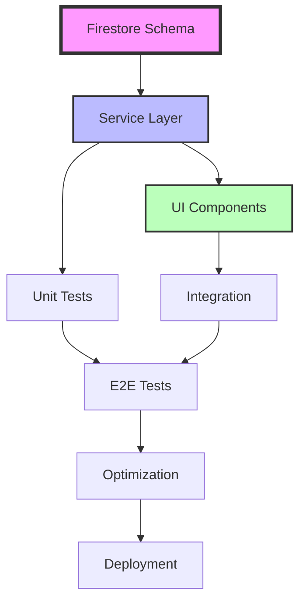

# 기업 관리 페이지 Task Board

## 🏃‍♂️ Sprint Overview

### Sprint 1 (Day 1-3): Backend Foundation
**Goal**: Complete database structure and service layer

### Sprint 2 (Day 4-7): Frontend Development  
**Goal**: Implement all UI components

### Sprint 3 (Day 8-10): Integration & Testing
**Goal**: Connect frontend to backend, comprehensive testing

### Sprint 4 (Day 11-12): Optimization & Deployment
**Goal**: Performance tuning and production readiness

---

## 📋 Kanban Board

### 🔴 Backlog
```
┌─────────────────────────────────────────┐
│ TASK-001: Firestore Security Rules      │
│ Priority: High | Est: 2h | Backend      │
├─────────────────────────────────────────┤
│ TASK-002: Migration Script              │
│ Priority: Med | Est: 3h | Backend       │
├─────────────────────────────────────────┤
│ TASK-003: Performance Monitoring        │
│ Priority: Low | Est: 4h | DevOps        │
├─────────────────────────────────────────┤
│ TASK-004: User Documentation           │
│ Priority: Med | Est: 6h | Tech Writer   │
└─────────────────────────────────────────┘
```

### 🟡 In Progress
```
┌─────────────────────────────────────────┐
│ TASK-005: Organization Schema Extension │
│ Assignee: Backend Dev A                 │
│ Progress: ████████░░ 80%               │
├─────────────────────────────────────────┤
│ TASK-006: Department Collection Setup   │
│ Assignee: Backend Dev B                 │
│ Progress: ██████░░░░ 60%               │
└─────────────────────────────────────────┘
```

### 🟢 Ready for Review
```
┌─────────────────────────────────────────┐
│ TASK-007: BaseService Integration       │
│ Reviewer: Senior Backend                │
│ PR: #234 | Tests: ✅                   │
├─────────────────────────────────────────┤
│ TASK-008: Type Definitions              │
│ Reviewer: Tech Lead                     │
│ PR: #235 | Tests: ✅                   │
└─────────────────────────────────────────┘
```

### ✅ Done
```
┌─────────────────────────────────────────┐
│ TASK-009: Project Setup                 │
│ Completed: Day 0 | By: Team            │
├─────────────────────────────────────────┤
│ TASK-010: Design Review                 │
│ Completed: Day 0 | By: Stakeholders    │
└─────────────────────────────────────────┘
```

---

## 📊 Task Dependencies



---

## 👥 Team Allocation

### Backend Team (2 developers)
```
Developer A (Senior):
├── Organization Schema Extension
├── Service Layer Architecture
└── Performance Optimization

Developer B (Mid):
├── Department & Member Collections
├── CRUD Method Implementation
└── Unit Test Coverage
```

### Frontend Team (2 developers)
```
Developer C (Senior):
├── Main Container Setup
├── Organization Structure Tab
└── Performance Optimization

Developer D (Mid):
├── Hero Section
├── Company Info Tab
├── Member Management Tab
└── Permission Settings Tab
```

### Support Team
```
QA Engineer:
├── Test Strategy
├── E2E Test Suite
└── Performance Testing

DevOps Engineer:
├── CI/CD Pipeline
├── Monitoring Setup
└── Deployment Automation

Designer:
├── Asset Creation
├── Micro-interactions
└── Responsive Validation
```

---

## 📈 Progress Tracking

### Week 1 Progress
```
Backend Infrastructure  ████████████████████ 100%
Service Implementation  ████████████░░░░░░░░  60%
Frontend Components     ████░░░░░░░░░░░░░░░░  20%
Testing                 ██░░░░░░░░░░░░░░░░░░  10%
Documentation          ████░░░░░░░░░░░░░░░░  20%
```

### Daily Standup Topics
- **Day 1**: Schema design review, service architecture
- **Day 2**: CRUD implementation progress, blockers
- **Day 3**: Testing strategy, frontend kickoff
- **Day 4**: UI component structure, design handoff
- **Day 5**: Integration points, API contracts
- **Day 6**: Feature demo, feedback incorporation
- **Day 7**: Testing progress, bug triage
- **Day 8**: Integration issues, performance metrics
- **Day 9**: E2E test results, optimization opportunities
- **Day 10**: Bug fixes, feature freeze
- **Day 11**: Performance tuning, deployment prep
- **Day 12**: Go/No-go decision, launch readiness

---

## 🚨 Risk Register

### High Priority Risks
```
┌─────────────────────────────────────────────────┐
│ RISK-001: Firestore Query Complexity            │
│ Impact: High | Probability: Medium              │
│ Mitigation: Early spike, alternative approaches │
├─────────────────────────────────────────────────┤
│ RISK-002: Large Organization Performance        │
│ Impact: High | Probability: High               │
│ Mitigation: Virtualization, pagination         │
└─────────────────────────────────────────────────┘
```

### Medium Priority Risks
```
┌─────────────────────────────────────────────────┐
│ RISK-003: Third-party Library Compatibility     │
│ Impact: Medium | Probability: Low              │
│ Mitigation: Early POC, fallback options       │
├─────────────────────────────────────────────────┤
│ RISK-004: Design Complexity                     │
│ Impact: Medium | Probability: Medium           │
│ Mitigation: Iterative design, user feedback   │
└─────────────────────────────────────────────────┘
```

---

## 🎯 Definition of Done

### Code Quality
- [ ] Code review approved by 2+ developers
- [ ] Unit test coverage > 80%
- [ ] No ESLint errors or warnings
- [ ] TypeScript strict mode compliance

### Functionality
- [ ] Feature works as specified in PRD
- [ ] Cross-browser compatibility verified
- [ ] Mobile responsive design implemented
- [ ] Accessibility standards met (WCAG 2.1 AA)

### Documentation
- [ ] API documentation updated
- [ ] Component documentation in Storybook
- [ ] README updated with setup instructions
- [ ] Changelog entry added

### Testing
- [ ] Unit tests passing
- [ ] Integration tests passing
- [ ] E2E tests for critical paths
- [ ] Performance benchmarks met

---

## 📅 Milestone Schedule

### Milestone 1: Backend Complete (Day 3)
- ✅ Firestore structure implemented
- ✅ Service layer functional
- ✅ Basic API tests passing

### Milestone 2: UI Components Complete (Day 7)
- ⏳ All tabs implemented
- ⏳ Component tests passing
- ⏳ Design review approved

### Milestone 3: Integration Complete (Day 10)
- ⏱️ Frontend-backend connected
- ⏱️ E2E tests passing
- ⏱️ Bug fixes complete

### Milestone 4: Production Ready (Day 12)
- ⏱️ Performance optimized
- ⏱️ Deployment automated
- ⏱️ Documentation complete

---

## 🔄 Continuous Improvement

### Retrospective Topics
1. What went well?
2. What could be improved?
3. Action items for next sprint

### Metrics to Track
- Velocity (story points completed)
- Bug discovery rate
- Test coverage trend
- Performance metrics
- Team satisfaction

### Lessons Learned (To be filled)
- [ ] Technical discoveries
- [ ] Process improvements
- [ ] Tool recommendations
- [ ] Architecture decisions